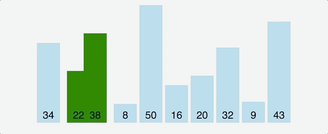
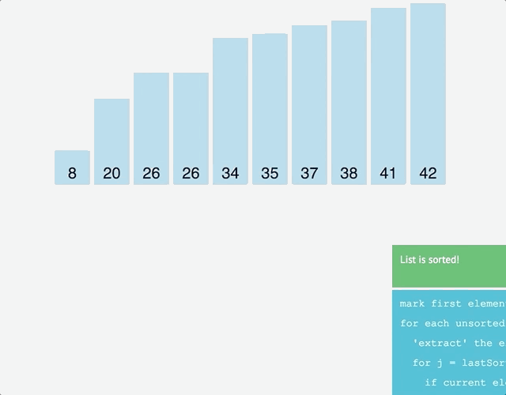

RESIZABLE(bottom right corner)

Clarify the concept of recursion
================================

What's the difference and connections between recursion, divide-and-conquer algorithm, dynamic programming, and greedy algorithm? If you haven't made it clear. Doesn't matter! I would give you a brief introduction to kick off this section.

Recursion is a programming technique. It's a way of thinking about solving problems. There're two algorithmic ideas to solve specific problems: divide-and-conquer algorithm and dynamic programming. They're largely based on recursive thinking (although the final version of dynamic programming is rarely recursive, the problem-solving idea is still inseparable from recursion). There's also an algorithmic idea called greedy algorithm which can efficiently solve some more special problems. And it's a subset of dynamic programming algorithms.

The divide-and-conquer algorithm will be explained in this section. Taking the most classic merge sort as an example, it continuously divides the unsorted array into smaller sub-problems. This is the origin of the word **divide and conquer**. Obviously, the sub-problems decomposed by the ranking problem are non-repeating. If some of the sub-problems after decomposition are duplicated (the nature of overlapping sub-problems), then the dynamic programming algorithm is used to solve them!

Recursion in detail
-------------------

Before introducing divide and conquer algorithm, we must first understand the concept of recursion.

The basic idea of recursion is that a function calls itself directly or indirectly, which transforms the solution of the original problem into many smaller sub-problems of the same nature. All we need is to focus on how to divide the original problem into qualified sub-problems, rather than study how this sub-problem is solved. The difference between recursion and enumeration is that enumeration divides the problem horizontally and then solves the sub-problems one by one, but recursion divides the problem vertically and then solves the sub-problems hierarchily.

The following illustrates my understanding of recursion. **If you don't want to read, please just remember how to answer these questions:**

1.  How to sort a bunch of numbers? Answer: Divided into two halves, first align the left half, then the right half, and finally merge. As for how to arrange the left and right half, please read this sentence again.
2.  How many hairs does Monkey King have? Answer: One plus the rest.
3.  How old are you this year? Answer: One year plus my age of last year, I was born in 1999.

Two of the most important characteristics of recursive code: **end conditions and self-invocation**. Self-invocation is aimed at solving sub-problems, and the end condition defines the answer to the simplest sub-problem.

    int func(How old are you this year) {

        // simplest sub-problem, end condition
        if (this year equals 1999) return my age 0;
        // self-calling to decompose problem
        return func(How old are you last year) + 1;   

    }

Actually think about it, **what is the most successful application of recursion? I think it's mathematical induction**. Most of us learned mathematical induction in high school. The usage scenario is probably: we can't figure out a summation formula, but we tried a few small numbers which seemed containing a kinda law, and then we compiled a formula. We ourselves think it shall be the correct answer. However, mathematics is very rigorous. Even if you've tried 10,000 cases which are correct, can you guarantee the 10001th correct? This requires mathematical induction to exert its power. Assuming that the formula we compiled is true at the kth number, furthermore if it is proved correct at the k + 1th, then the formula we have compiled is verified correct.

So what is the connection between mathematical induction and recursion? We just said that the recursive code must have an end condition. If not, it will fall into endless self-calling hell until the memory exhausted. The difficulty of mathematical proof is that you can try to have a finite number of cases, but it is difficult to extend your conclusion to infinity. Here you can see the connection-infinite.

The essence of recursive code is to call itself to solve smaller sub-problems until the end condition is reached. The reason why mathematical induction is useful is to continuously increase our guess by one, and expand the size of the conclusion, without end condition. So by extending the conclusion to infinity, the proof of the correctness of the guess is completed.

### Why learn recursion

First to train the ability to think reversely. Recursive thinking is the thinking of normal people, always looking at the problems in front of them and thinking about solutions, and the solution is the future tense; Recursive thinking forces us to think reversely, see the end of the problem, and treat the problem-solving process as the past tense.

Second, practice analyzing the structure of the problem. When the problem can be broken down into sub problems of the same structure, you can acutely find this feature, and then solve it efficiently.

Third, go beyond the details and look at the problem as a whole. Let's talk about merge and sort. In fact, you can divide the left and right areas without recursion, but the cost is that the code is extremely difficult to understand. Take a look at the code below (merge sorting will be described later. You can understand the meaning here, and appreciate the beauty of recursion).

    void sort(Comparable[] a){    
        int N = a.length;
        // So complicated! It shows disrespect for sorting. I refuse to study such code.
        for (int sz = 1; sz < N; sz = sz + sz)
            for (int lo = 0; lo < N - sz; lo += sz + sz)
                merge(a, lo, lo + sz - 1, Math.min(lo + sz + sz - 1, N - 1));
    }

    /* I prefer recursion, simple and beautiful */
    void sort(Comparable[] a, int lo, int hi) {
        if (lo >= hi) return;
        int mid = lo + (hi - lo) / 2;
        sort(a, lo, mid); // soft left part
        sort(a, mid + 1, hi); // soft right part
        merge(a, lo, mid, hi); // merge the two sides
    }

Looks simple and beautiful is one aspect, the key is **very interpretable**: sort the left half, sort the right half, and finally merge the two sides. The non-recursive version looks unintelligible, full of various incomprehensible boundary calculation details, is particularly prone to bugs and difficult to debug. Life is short, i prefer the recursive version.

Obviously, sometimes recursive processing is efficient, such as merge sort, **sometimes inefficient**, such as counting the hair of Monkey King, because the stack consumes extra space but simple inference does not consume space. Example below gives a linked list header and calculate its length:

    /* Typical recursive traversal framework requires extra space O(1) */
    public int size(Node head) {
        int size = 0;
        for (Node p = head; p != null; p = p.next) size++;
        return size;
    }
    /* I insist on recursion facing every problem. I need extra space O(N) */
    public int size(Node head) {
        if (head == null) return 0;
        return size(head.next) + 1;
    }

### Tips for writing recursion

My point of view: **Understand what a function does and believe it can accomplish this task. Don't try to jump into the details.** Do not jump into this function to try to explore more details, otherwise you will fall into infinite details and cannot extricate yourself. The human brain carries tiny sized stack!

Let's start with the simplest example: traversing a binary tree.

    void traverse(TreeNode* root) {
        if (root == nullptr) return;
        traverse(root->left);
        traverse(root->right);
    }

Above few lines of code are enough to wipe out any binary tree. What I want to say is that for the recursive function `traverse (root)` , we just need to believe: give it a root node `root` , and it can traverse the whole tree. Since this function is written for this specific purpose, so we just need to dump the left and right nodes of this node to this function, because I believe it can surely complete the task. What about traversing an N-fork tree? It's too simple, exactly the same as a binary tree!

    void traverse(TreeNode* root) {
        if (root == nullptr) return;
        for (child : root->children)
            traverse(child);
    }

As for pre-order, mid-order, post-order traversal, they are all obvious. For N-fork tree, there is obviously no in-order traversal.

The following **explains a problem from LeetCode in detail**: Given a binary tree and a target value, the values in every node is positive or negative, return the number of paths in the tree that are equal to the target value, let you write the pathSum function:

`/* from LeetCode PathSum III： https://leetcode.com/problems/path-sum-iii/ */      root = [10,5,-3,3,2,null,11,3,-2,null,1],      sum = 8       10      / \      5 -3      / \ \      3 2 11      / \ \      3 -2 1       Return 3. The paths that sum to 8 are:       1. 5 -> 3      2. 5 -> 2 -> 1      3. -3 -> 11  `

    /* It doesn't matter if you don't understand, there is a more detailed analysis version below, which highlights the conciseness and beauty of recursion. */
    int pathSum(TreeNode root, int sum) {
        if (root == null) return 0;
        return count(root, sum) + 
            pathSum(root.left, sum) + pathSum(root.right, sum);
    }
    int count(TreeNode node, int sum) {
        if (node == null) return 0;
        return (node.val == sum) + 
            count(node.left, sum - node.val) + count(node.right, sum - node.val);
    }

The problem may seem complicated, but the code is extremely concise, which is the charm of recursion. Let me briefly summarize the **solution process** of this problem:

First of all, it is clear that to solve the problem of recursive tree, you must traverse the entire tree. So the traversal framework of the binary tree (recursively calling the function itself on the left and right children) must appear in the main function pathSum. And then, what should they do for each node? They should see how many eligible paths they and their little children have under their feet. Well, this question is clear.

According to the techniques mentioned earlier, define what each recursive function should do based on the analysis just now:

PathSum function: Give it a node and a target value. It returns the total number of paths in the tree rooted at this node and the target value.

Count function: Give it a node and a target value. It returns a tree rooted at this node, and can make up the total number of paths starting with the node and the target value.

    /* With above tips, comment out the code in detail */
    int pathSum(TreeNode root, int sum) {
        if (root == null) return 0;
        int pathImLeading = count(root, sum); // Number of paths beginning with itself
        int leftPathSum = pathSum(root.left, sum); // The total number of paths on the left (Believe he can figure it out)
        int rightPathSum = pathSum(root.right, sum); // The total number of paths on the right (Believe he can figure it out)
        return leftPathSum + rightPathSum + pathImLeading;
    }
    int count(TreeNode node, int sum) {
        if (node == null) return 0;
        // Can I stand on my own as a separate path?
        int isMe = (node.val == sum) ? 1 : 0;
        // Left brother, how many sum-node.val can you put together?
        int leftBrother = count(node.left, sum - node.val); 
        // Right brother, how many sum-node.val can you put together?
        int rightBrother = count(node.right, sum - node.val);
        return  isMe + leftBrother + rightBrother; // all count i can make up
    }

Again, understand what each function can do and trust that they can do it.

In summary, the binary tree traversal framework provided by the PathSum function calls the count function for each node during the traversal. Can you see the pre-order traversal (the order is the same for this question)? The count function is also a binary tree traversal, used to find the target value path starting with this node. Understand it deeply!

Divide and conquer algorithm
----------------------------

**Merge and sort**, typical divide-and-conquer algorithm; divide-and-conquer, typical recursive structure.

The divide-and-conquer algorithm can go in three steps: decomposition-&gt; solve-&gt; merge

1.  Decompose the original problem into sub-problems with the same structure.
2.  After decomposing to an easy-to-solve boundary, perform a recursive solution.
3.  Combine the solutions of the subproblems into the solutions of the original problem.

To merge and sort, let's call this function `merge_sort` . According to what we said above, we must clarify the responsibility of the function, that is, **sort an incoming array**. OK, can this problem be solved? Of course! Sorting an array is just the same to sorting the two halves of the array separately, and then merging the two halves.

    void merge_sort(an array) {
        if (some tiny array easy to solve) return;
        merge_sort(left half array);
        merge_sort(right half array);
        merge(left half array, right half array);
    }

Well, this algorithm is like this, there is no difficulty at all. Remember what I said before, believe in the function's ability, and pass it to him half of the array, then the half of the array is already sorted. Have you found it's a binary tree traversal template? Why it is postorder traversal? Because the routine of our divide-and-conquer algorithm is **decomposition-&gt; solve (bottom)-&gt; merge (backtracking)** Ah, first left and right decomposition, and then processing merge, backtracking is popping stack, which is equivalent to post-order traversal. As for the `merge` function, referring to the merging of two ordered linked lists, they are exactly the same, and the code is directly posted below.

Let's refer to the Java code in book `Algorithm 4` below, which is pretty. This shows that not only algorithmic thinking is important, but coding skills are also very important! Think more and imitate more.

    public class Merge {
        // Do not construct new arrays in the merge function, because the merge function will be called multiple times, affecting performance.Construct a large enough array directly at once, concise and efficient.
        private static Comparable[] aux;

         public static void sort(Comparable[] a) {
            aux = new Comparable[a.length];
            sort(a, 0, a.length - 1);
        }

        private static void sort(Comparable[] a, int lo, int hi) {
            if (lo >= hi) return;
            int mid = lo + (hi - lo) / 2;
            sort(a, lo, mid);
            sort(a, mid + 1, hi);
            merge(a, lo, mid, hi);
        }

        private static void merge(Comparable[] a, int lo, int mid, int hi) {
            int i = lo, j = mid + 1;
            for (int k = lo; k <= hi; k++)
                aux[k] = a[k];
            for (int k = lo; k <= hi; k++) {
                if      (i > mid)              { a[k] = aux[j++]; }
                else if (j > hi)               { a[k] = aux[i++]; }
                else if (less(aux[j], aux[i])) { a[k] = aux[j++]; }
                else                           { a[k] = aux[i++]; }
            }
        }

        private static boolean less(Comparable v, Comparable w) {
            return v.compareTo(w) < 0;
        }
    }

LeetCode has a special exercise of the divide-and-conquer algorithm. Copy the link below to web browser and have a try:

https://leetcode.com/tag/divide-and-conquer/

Prompt: write a function that will reverse a string:

var reverse = function(string){  
if(string.length &lt; 2){

`return string; `

}  
var first = string\[0\]  
var last = string\[string.length-1\]; return last +reverse(string.slice(1, string.length-1)) + first; }; reverse('abcdef'); //returns 'fedcba'

**//explain what a recursive function is**

***A function that calls itself*** is a recursive function.

If a function calls itself… then that function calls itself… then that function calls itself… well… then we have fallen into an infinite loop (a very unproductive place to be). To benefit from recursive calls, we need to be careful to include to give our interpreter a way to break out of the cycle of recursive function calls; we call this a ***base case***.

The base case in the solution code above is as simple as testing that the length of the argument is less than 2… and if it is, returning the the value of that argument.

Notice how each time we recursively call the reverse function, we are passing it a shorter string argument… so each recursive call is getting us closer to hitting our ***base case***.

**//visualize the interpreter's path through recursive function calls**

Slow down and follow the interpreter through its execution of your algorithm (thanks to PythonTutor.com)

Python Tutor is an excellent resource for learning to visualize and trace variable values through the multiple execution contexts of a recursive function's invocation.

*Try it now with these simple steps:*

1.  *copy the solution code from above*
2.  *go over to* [*http://pythontutor.com/javascript.html\#mode=edit*](http://pythontutor.com/javascript.html#mode=edit)
3.  *paste the solution code into the editor*
4.  *click the "Visualize Execution" button*
5.  *progress through the execution with the "forward" button*

**//when can a recursive function help me?**

So if I hope that at this point that you are thinking: there is a ***better*** way to reverse a function, or there is a ***simpler*** way to reverse a string…

First off… ***simpler is better.*** Writing good code isn't about being clever or fancy; good code is about writing code that works, that makes sense to as many other minds as possible, that is time efficient, and that is memory efficient (in order of importance). As new programers, the first of these criteria is obvious, and the last two are given way too much weight. It's the second of these criteria that needs to carry much more weight in our minds and deserves the most attention. Recursive functions can be a powerful tool in helping us write clear and simple solutions.

To be clear: recursion is not about being fancy or clever… it is an important skill to wrestle with early because there will be many scenarios when employing recursion will allow for a simpler and more reliable solution than would be possible without recursive functions.

**//more useful example**

Prompt: check to see if a binary-search-tree contains a value

var searchBST = function(tree, num){  
if(tree.val === num){

`return true `

} else if(num &gt; tree.val){

`if(tree.right === null){      return false;      } else{      return searchBST(tree.right, num);      } `

} else{

`if(tree.left === null){      return false;      } else{      return searchBST(tree.left, num);      } `

}  
}; var tree = {val: 9,

` left: {val: 5,      left: null,      right: {val: 7,      left: null,      right: null}      },      right: {val: 20,      left: {val: 16,      left: null,      right: {val: 18,      left: null,      right: null}      },      right: null}      };searchBST(tree, 18) // return true `

searchBST(tree, 4) // return false

When traversing trees and many other other non-primative data structures, recursion allows us to define a clear algorithm that elegantly handles uncertainty and complexity. Without recursion, it would be impossible to write a single function that could search a binary search tree of any size and state… yet by employing recursion, we can write a concise algorithm that will traverse any binary search tree and determine if it contains a value or not.

Take a moment to analyze how recursion is used in this example by tracing the interpreters path through this solution. Just as we did for the reverse function above, paste this binary search tree code snippet into the editor at <http://pythontutor.com/javascript.html#mode=display>

In this function definition, there are three base cases that will return a value instead of recursively calling the searchBST function… can you find them?

//now go practice using recursion

 *Data Structures and Algorithms*
================================

------------------------------------------------------------------------

[**Big O**](README.html#big-o-) [**Memoization And Tabulation**](README.html#memoization-and-tabulation-) - [Recursion Videos](README.html#recursion-videos) - [Curating Complexity: A Guide to Big-O Notation](README.html#curating-complexity-a-guide-to-big-o-notation) - [Why Big-O?](README.html#why-big-o) - [Big-O Notation](README.html#big-o-notation) - [Common Complexity Classes](README.html#common-complexity-classes) - [The seven major classes](README.html#the-seven-major-classes) - [Memoization](README.html#memoization) - [Memoizing factorial](README.html#memoizing-factorial) - [Memoizing the Fibonacci generator](README.html#memoizing-the-fibonacci-generator) - [The memoization formula](README.html#the-memoization-formula) - [Tabulation](README.html#tabulation) - [Tabulating the Fibonacci number](README.html#tabulating-the-fibonacci-number) - [Aside: Refactoring for O(1) Space](README.html#aside-refactoring-for-o1-space) - [Analysis of Linear Search](README.html#analysis-of-linear-search) - [Analysis of Binary Search](README.html#analysis-of-binary-search) - [Analysis of the Merge Sort](README.html#analysis-of-the-merge-sort) - [Analysis of Bubble Sort](README.html#analysis-of-bubble-sort) - [LeetCode.com](README.html#leetcodecom) - [Memoization Problems](README.html#memoization-problems) - [Tabulation Problems](README.html#tabulation-problems)

[**Sorting Algorithms**](README.html#sorting-algorithms-) - [Bubble Sort](README.html#bubble-sort) - [*"But…then…why are we…"*](README.html#_butthenwhy-are-we_) - [The algorithm bubbles up](README.html#the-algorithm-bubbles-up) - [How does a pass of Bubble Sort work?](README.html#how-does-a-pass-of-bubble-sort-work) - [Ending the Bubble Sort](README.html#ending-the-bubble-sort) - [Pseudocode for Bubble Sort](README.html#pseudocode-for-bubble-sort) - [Selection Sort](README.html#selection-sort) - [The algorithm: select the next smallest](README.html#the-algorithm-select-the-next-smallest) - [The pseudocode](README.html#the-pseudocode) - [Insertion Sort](README.html#insertion-sort) - [The algorithm: insert into the sorted region](README.html#the-algorithm-insert-into-the-sorted-region) - [The Steps](README.html#the-steps) - [The pseudocode](README.html#the-pseudocode-1) - [Merge Sort](README.html#merge-sort) - [The algorithm: divide and conquer](README.html#the-algorithm-divide-and-conquer) - [Quick Sort](README.html#quick-sort) - [How does it work?](README.html#how-does-it-work) - [The algorithm: divide and conquer](README.html#the-algorithm-divide-and-conquer-1) - [The pseudocode](README.html#the-pseudocode-2) - [Binary Search](README.html#binary-search) - [The Algorithm: "check the middle and half the search space"](README.html#the-algorithm-check-the-middle-and-half-the-search-space) - [The pseudocode](README.html#the-pseudocode-3) - [Bubble Sort Analysis](README.html#bubble-sort-analysis) - [Time Complexity: O(n2)](README.html#time-complexity-onsup2sup) - [Space Complexity: O(1)](README.html#space-complexity-o1) - [When should you use Bubble Sort?](README.html#when-should-you-use-bubble-sort) - [Selection Sort Analysis](README.html#selection-sort-analysis) - [Selection Sort JS Implementation](README.html#selection-sort-js-implementation) - [Time Complexity Analysis](README.html#time-complexity-analysis) - [Space Complexity Analysis: O(1)](README.html#space-complexity-analysis-o1) - [When should we use Selection Sort?](README.html#when-should-we-use-selection-sort) - [Insertion Sort Analysis](README.html#insertion-sort-analysis) - [Time and Space Complexity Analysis](README.html#time-and-space-complexity-analysis) - [When should you use Insertion Sort?](README.html#when-should-you-use-insertion-sort) - [Merge Sort Analysis](README.html#merge-sort-analysis) - [Full code](README.html#full-code) - [Merging two sorted arrays](README.html#merging-two-sorted-arrays) - [Divide and conquer, step-by-step](README.html#divide-and-conquer-step-by-step) - [Time and Space Complexity Analysis](README.html#time-and-space-complexity-analysis-1) - [Quick Sort Analysis](README.html#quick-sort-analysis) - [Time and Space Complexity Analysis](README.html#time-and-space-complexity-analysis-2) - [Binary Search Analysis](README.html#binary-search-analysis) - [Time and Space Complexity Analysis](README.html#time-and-space-complexity-analysis-3) - [Practice: Bubble Sort](README.html#practice-bubble-sort) - [Practice: Selection Sort](README.html#practice-selection-sort) - [Practice: Insertion Sort](README.html#practice-insertion-sort) - [Practice: Merge Sort](README.html#practice-merge-sort) - [Practice: Quick Sort](README.html#practice-quick-sort-2) - [Practice: Binary Search](README.html#practice-binary-search)

[**Lists, Stacks, and Queues**](README.html#lists-stacks-and-queues-) - [Linked Lists](README.html#linked-lists) - [What is a Linked List?](README.html#what-is-a-linked-list) - [Types of Linked Lists](README.html#types-of-linked-lists) - [Linked List Methods](README.html#linked-list-methods) - [Time and Space Complexity Analysis](README.html#time-and-space-complexity-analysis-4) - [Time Complexity - Access and Search](README.html#time-complexity-access-and-search) - [Time Complexity - Insertion and Deletion](README.html#time-complexity-insertion-and-deletion) - [Space Complexity](README.html#space-complexity-1) - [Stacks and Queues](README.html#stacks-and-queues) - [What is a Stack?](README.html#what-is-a-stack) - [What is a Queue?](README.html#what-is-a-queue) - [Stack and Queue Properties](README.html#stack-and-queue-properties) - [Stack Methods](README.html#stack-methods) - [Queue Methods](README.html#queue-methods) - [Time and Space Complexity Analysis](README.html#time-and-space-complexity-analysis-5) - [When should we use Stacks and Queues?](README.html#when-should-we-use-stacks-and-queues) -

[**Graphs and Heaps**](README.html#graphs-and-heaps-) - [Introduction to Heaps](README.html#introduction-to-heaps) - [Binary Heap Implementation](README.html#binary-heap-implementation) - [Heap Sort](README.html#heap-sort) - [In-Place Heap Sort](README.html#in-place-heap-sort) -

------------------------------------------------------------------------

Big O
=====

**The objective of this lesson** is get you comfortable with identifying the time and space complexity of code you see. Being able to diagnose time complexity for algorithms is an essential for interviewing software engineers.

At the end of this, you will be able to

1.  Order the common complexity classes according to their growth rate
2.  Identify the complexity classes of common sort methods
3.  Identify complexity classes of codeable with identifying the time and space complexity of code you see. Being able to diagnose time complexity for algorithms is an essential for interviewing software engineers.

At the end of this, you will be able to

1.  Order the common complexity classes according to their growth rate
2.  Identify the complexity classes of common sort methods
3.  Identify complexity classes of code

------------------------------------------------------------------------

Memoization And Tabulation
==========================

**The objective of this lesson** is to give you a couple of ways to optimize a computation (algorithm) from a higher complexity class to a lower complexity class. Being able to optimize algorithms is an essential for interviewing software engineers.

At the end of this, you will be able to

1.  Apply memoization to recursive problems to make them less than polynomial time.
2.  Apply tabulation to iterative problems to make them less than polynomial time.\*\* is to give you a couple of ways to optimize a computation (algorithm) from a higher complexity class to a lower complexity class. Being able to optimize algorithms is an essential for interviewing software engineers.

At the end of this, you will be able to

1.  Apply memoization to recursive problems to make them less than polynomial time.
2.  Apply tabulation to iterative problems to make them less than polynomial time.

------------------------------------------------------------------------

Recursion Videos
================

A lot of algorithms that we use in the upcoming days will use recursion. The next two videos are just helpful reminders about recursion so that you can get that thought process back into your brain.

------------------------------------------------------------------------

Big-O By Colt Steele
====================

Colt Steele provides a very nice, non-mathy introduction to Big-O notation. Please watch this so you can get the easy introduction. Big-O is, by its very nature, math based. It's good to get an understanding before jumping in to math expressions.

[Complete Beginner's Guide to Big O Notation](https://www.youtube.com/embed/kS_gr2_-ws8) by Colt Steele.

------------------------------------------------------------------------

Curating Complexity: A Guide to Big-O Notation
==============================================

As software engineers, our goal is not just to solve problems. Rather, our goal is to solve problems efficiently and elegantly. Not all solutions are made equal! In this section we'll explore how to analyze the efficiency of algorithms in terms of their speed (*time complexity*) and memory consumption (*space complexity*).

> In this article, we'll use the word *efficiency* to describe the amount of resources a program needs to execute. The two resources we are concerned with are *time* and *space*. Our goal is to *minimize* the amount of time and space that our programs use.

When you finish this article you will be able to:

-   explain why computer scientists use Big-O notation
-   simplify a mathematical function into Big-O notation

Why Big-O?
----------

Let's begin by understanding what method we should *not* use when describing the efficiency of our algorithms. Most importantly, we'll want to avoid using absolute units of time when describing speed. When the software engineer exclaims, "My function runs in 0.2 seconds, it's so fast!!!", the computer scientist is not impressed. Skeptical, the computer scientist asks the following questions:

1.  What computer did you run it on? *Maybe the credit belongs to the hardware and not the software. Some hardware architectures will be better for certain operations than others.*
2.  Were there other background processes running on the computer that could have effected the runtime? *It's hard to control the environment during performance experiments.*
3.  Will your code still be performant if we increase the size of the input? *For example, sorting 3 numbers is trivial; but how about a million numbers?*

The job of the software engineer is to focus on the software detail and not necessarily the hardware it will run on. Because we can't answer points 1 and 2 with total certainty, we'll want to avoid using concrete units like "milliseconds" or "seconds" when describing the efficiency of our algorithms. Instead, we'll opt for a more abstract approach that focuses on point 3. This means that we should focus on how the performance of our algorithm is affected by increasing the size of the input. **In other words, how does our performance scale?**

> The argument above focuses on *time*, but a similar argument could also be made for *space*. For example, we should not analyze our code in terms of the amount of absolute kilobytes of memory it uses, because this is dependent on the programming language.

Big-O Notation
--------------

In Computer Science, we use Big-O notation as a tool for describing the efficiency of algorithms with respect to the size of the input argument(s). We use mathematical functions in Big-O notation, so there are a few big picture ideas that we'll want to keep in mind:

1.  The function should be defined in terms of the size of the input(s).
2.  A *smaller* Big-O function is more desirable than a larger one. Intuitively, we want our algorithms to use a minimal amount of time and space.
3.  Big-O describes the worst-case scenario for our code, also known as the upper bound. We prepare our algorithm for the worst case, because the best case is a luxury that is not guaranteed.
4.  A Big-O function should be simplified to show only its most dominant mathematical term.

The first 3 points are conceptual, so they are easy to swallow. However, point 4 is typically the biggest source of confusion when learning the notation. Before we apply Big-O to our code, we'll need to first understand the underlying math and simplification process.

### Simplifying Math Terms

We want our Big-O notation to describe the performance of our algorithm with respect to the input size and nothing else. Because of this, we should to simplify our Big-O functions using the following rules:

-   **Simplify Products:** if the function is a product of many terms, we drop the terms that *don't* depend on the size of the input.
-   **Simplify Sums:** if the function is a sum of many terms, we keep the term with the *largest* growth rate and drop the other terms.

We'll look at these rules in action, but first we'll define a few things:

-   **n** is the size of the input
-   **T(f)** refers to an unsimplified mathematical **f**unction
-   **O(f)** refers to the Big-O simplified mathematical **f**unction

### Simplifying a Product

If a function consists of a product of many factors, we drop the factors that don't depend on the size of the input, n. The factors that we drop are called constant factors because their size remains consistent as we increase the size of the input. The reasoning behind this simplification is that we make the input large enough, the non-constant factors will overshadow the constant ones. Below are some examples:

<table><thead><tr class="header"><th>Unsimplified</th><th>Big-O Simplified</th></tr></thead><tbody><tr class="odd"><td>T( 5 * n2 )</td><td>O( n2 )</td></tr><tr class="even"><td>T( 100000 * n )</td><td>O( n )</td></tr><tr class="odd"><td>T( n / 12 )</td><td>O( n )</td></tr><tr class="even"><td>T( 42 * n * log(n) )</td><td>O( n * log(n) )</td></tr><tr class="odd"><td>T( 12 )</td><td>O( 1 )</td></tr></tbody></table>

Note that in the third example, we can simplify `T( n /           12 )` to `O( n           )` because we can rewrite a division into an equivalent multiplication. In other words, `T( n / 12 ) = T( 1/12 *           n ) = O(           n           )`.

### Simplifying a Sum

If the function consists of a sum of many terms, we only need to show the term that grows the fastest, relative to the size of the input. The reasoning behind this simplification is that if we make the input large enough, the fastest growing term will overshadow the other, smaller terms. To understand which term to keep, you'll need to recall the relative size of our common math terms from the previous section. Below are some examples:

<table><thead><tr class="header"><th>Unsimplified</th><th>Big-O Simplified</th></tr></thead><tbody><tr class="odd"><td>T( n3 + n2 + n )</td><td>O( n3 )</td></tr><tr class="even"><td>T( log(n) + 2n )</td><td>O( 2n )</td></tr><tr class="odd"><td>T( n + log(n) )</td><td>O( n )</td></tr><tr class="even"><td>T( n! + 10n )</td><td>O( n! )</td></tr></tbody></table>

### Putting it all together

The *product* and *sum* rules are all we'll need to Big-O simplify any math functions. We just apply the *product rule* to drop all constants, then apply the *sum rule* to select the single most dominant term.

<table><thead><tr class="header"><th>Unsimplified</th><th>Big-O Simplified</th></tr></thead><tbody><tr class="odd"><td>T( 5n2 + 99n )</td><td>O( n2 )</td></tr><tr class="even"><td>T( 2n + nlog(n) )</td><td>O( nlog(n) )</td></tr><tr class="odd"><td>T( 2n + 5n1000)</td><td>O( 2n )</td></tr></tbody></table>

> Aside: We'll often omit the multiplication symbol in expressions as a form of shorthand. For example, we'll write *O( 5n2 )* in place of *O( 5 \* n2 )*.

RECAP
-----

-   explained why Big-O is the preferred notation used to describe the efficiency of algorithms
-   used the product and sum rules to simplify mathematical functions into Big-O notation

------------------------------------------------------------------------

Common Complexity Classes
=========================

Analyzing the efficiency of our code seems like a daunting task because there are many different possibilities in how we may choose to implement something. Luckily, most code we write can be categorized into one of a handful of common complexity classes. In this reading, we'll identify the common classes and explore some of the code characteristics that will lead to these classes.

When you finish this reading, you should be able to:

-   name *and* order the seven common complexity classes
-   identify the time complexity class of a given code snippet

The seven major classes
-----------------------

There are seven complexity classes that we will encounter most often. Below is a list of each complexity class as well as its Big-O notation. This list is ordered from *smallest to largest*. Bear in mind that a "more efficient" algorithm is one with a smaller complexity class, because it requires fewer resources.

<table><thead><tr class="header"><th>Big-O</th><th>Complexity Class Name</th></tr></thead><tbody><tr class="odd"><td>O(1)</td><td>constant</td></tr><tr class="even"><td>O(log(n))</td><td>logarithmic</td></tr><tr class="odd"><td>O(n)</td><td>linear</td></tr><tr class="even"><td>O(n * log(n))</td><td>loglinear, linearithmic, quasilinear</td></tr><tr class="odd"><td>O(nc) - O(n2), O(n3), etc.</td><td>polynomial</td></tr><tr class="even"><td>O(cn) - O(2n), O(3n), etc.</td><td>exponential</td></tr><tr class="odd"><td>O(n!)</td><td>factorial</td></tr></tbody></table>

There are more complexity classes that exist, but these are most common. Let's take a closer look at each of these classes to gain some intuition on what behavior their functions define. We'll explore famous algorithms that correspond to these classes further in the course.

For simplicity, we'll provide small, generic code examples that illustrate the complexity, although they may not solve a practical problem.

### O(1) - Constant

Constant complexity means that the algorithm takes roughly the same number of steps for any size input. In a constant time algorithm, there is no relationship between the size of the input and the number of steps required. For example, this means performing the algorithm on a input of size 1 takes the same number of steps as performing it on an input of size 128.

#### Constant growth

The table below shows the growing behavior of a constant function. Notice that the behavior stays *constant* for all values of n.

<table><thead><tr class="header"><th>n</th><th>O(1)</th></tr></thead><tbody><tr class="odd"><td>1</td><td>~1</td></tr><tr class="even"><td>2</td><td>~1</td></tr><tr class="odd"><td>3</td><td>~1</td></tr><tr class="even"><td>…</td><td>…</td></tr><tr class="odd"><td>128</td><td>~1</td></tr></tbody></table>

#### Example Constant code

Below is are two examples of functions that have constant runtimes.

    // O(1)
    function constant1(n) {
      return n * 2 + 1;
    }

    // O(1)
    function constant2(n) {
      for (let i = 1; i <= 100; i++) {
        console.log(i);
      }
    }

The runtime of the `constant1` function does not depend on the size of the input, because only two arithmetic operations (multiplication and addition) are always performed. The runtime of the `constant2` function also does not depend on the size of the input because one-hundred iterations are always performed, irrespective of the input.

### O(log(n)) - Logarithmic

Typically, the hidden base of O(log(n)) is 2, meaning O(log2(n)). Logarithmic complexity algorithms will usual display a sense of continually "halving" the size of the input. Another tell of a logarithmic algorithm is that we don't have to access every element of the input. O(log2(n)) means that every time we double the size of the input, we only require one additional step. Overall, this means that a large increase of input size will increase the number of steps required by a small amount.

#### Logarithmic growth

The table below shows the growing behavior of a logarithmic runtime function. Notice that doubling the input size will only require only one additional "step".

<table><thead><tr class="header"><th>n</th><th>O(log2(n))</th></tr></thead><tbody><tr class="odd"><td>2</td><td>~1</td></tr><tr class="even"><td>4</td><td>~2</td></tr><tr class="odd"><td>8</td><td>~3</td></tr><tr class="even"><td>16</td><td>~4</td></tr><tr class="odd"><td>…</td><td>…</td></tr><tr class="even"><td>128</td><td>~7</td></tr></tbody></table>

#### Example logarithmic code

Below is an example of two functions with logarithmic runtimes.

    // O(log(n))
    function logarithmic1(n) {
      if (n <= 1) return;
      logarithmic1(n / 2);
    }

    // O(log(n))
    function logarithmic2(n) {
      let i = n;
      while (i > 1) {
        i /= 2;
      }
    }

The `logarithmic1` function has O(log(n)) runtime because the recursion will half the argument, n, each time. In other words, if we pass 8 as the original argument, then the recursive chain would be 8 -&gt; 4 -&gt; 2 -&gt; 1. In a similar way, the `logarithmic2` function has O(log(n)) runtime because of the number of iterations in the while loop. The while loop depends on the variable `i`, which will be divided in half each iteration.

### O(n) - Linear

Linear complexity algorithms will access each item of the input "once" (in the Big-O sense). Algorithms that iterate through the input without nested loops or recurse by reducing the size of the input by "one" each time are typically linear.

#### Linear growth

The table below shows the growing behavior of a linear runtime function. Notice that a change in input size leads to similar change in the number of steps.

<table><thead><tr class="header"><th>n</th><th>O(n)</th></tr></thead><tbody><tr class="odd"><td>1</td><td>~1</td></tr><tr class="even"><td>2</td><td>~2</td></tr><tr class="odd"><td>3</td><td>~3</td></tr><tr class="even"><td>4</td><td>~4</td></tr><tr class="odd"><td>…</td><td>…</td></tr><tr class="even"><td>128</td><td>~128</td></tr></tbody></table>

#### Example linear code

Below are examples of three functions that each have linear runtime.

    // O(n)
    function linear1(n) {
      for (let i = 1; i <= n; i++) {
        console.log(i);
      }
    }

    // O(n), where n is the length of the array
    function linear2(array) {
      for (let i = 0; i < array.length; i++) {
        console.log(i);
      }
    }

    // O(n)
    function linear3(n) {
      if (n === 1) return;
      linear3(n - 1);
    }

The `linear1` function has O(n) runtime because the for loop will iterate n times. The `linear2` function has O(n) runtime because the for loop iterates through the array argument. The `linear3` function has O(n) runtime because each subsequent call in the recursion will decrease the argument by one. In other words, if we pass 8 as the original argument to `linear3`, the recursive chain would be 8 -&gt; 7 -&gt; 6 -&gt; 5 -&gt; … -&gt; 1.

### O(n \* log(n)) - Loglinear

This class is a combination of both linear and logarithmic behavior, so features from both classes are evident. Algorithms the exhibit this behavior use both recursion and iteration. Typically, this means that the recursive calls will halve the input each time (logarithmic), but iterations are also performed on the input (linear).

#### Loglinear growth

The table below shows the growing behavior of a loglinear runtime function.

<table><thead><tr class="header"><th>n</th><th>O(n * log2(n))</th></tr></thead><tbody><tr class="odd"><td>2</td><td>~2</td></tr><tr class="even"><td>4</td><td>~8</td></tr><tr class="odd"><td>8</td><td>~24</td></tr><tr class="even"><td>…</td><td>…</td></tr><tr class="odd"><td>128</td><td>~896</td></tr></tbody></table>

#### Example loglinear code

Below is an example of a function with a loglinear runtime.

    // O(n * log(n))
    function loglinear(n) {
      if (n <= 1) return;

      for (let i = 1; i <= n; i++) {
        console.log(i);
      }

      loglinear(n / 2);
      loglinear(n / 2);
    }

The `loglinear` function has O(n \* log(n)) runtime because the for loop iterates linearly (n) through the input and the recursive chain behaves logarithmically (log(n)).

### O(nc) - Polynomial

Polynomial complexity refers to complexity of the form O(nc) where `n` is the size of the input and `c` is some fixed constant. For example, O(n3) is a larger/worse function than O(n2), but they belong to the same complexity class. Nested loops are usually the indicator of this complexity class.

#### Polynomial growth

Below are tables showing the growth for O(n2) and O(n3).

<table><thead><tr class="header"><th>n</th><th>O(n2)</th></tr></thead><tbody><tr class="odd"><td>1</td><td>~1</td></tr><tr class="even"><td>2</td><td>~4</td></tr><tr class="odd"><td>3</td><td>~9</td></tr><tr class="even"><td>…</td><td>…</td></tr><tr class="odd"><td>128</td><td>~16,384</td></tr></tbody></table>

<table><thead><tr class="header"><th>n</th><th>O(n3)</th></tr></thead><tbody><tr class="odd"><td>1</td><td>~1</td></tr><tr class="even"><td>2</td><td>~8</td></tr><tr class="odd"><td>3</td><td>~27</td></tr><tr class="even"><td>…</td><td>…</td></tr><tr class="odd"><td>128</td><td>~2,097,152</td></tr></tbody></table>

#### Example polynomial code

Below are examples of two functions with polynomial runtimes.

    // O(n^2)
    function quadratic(n) {
      for (let i = 1; i <= n; i++) {
        for (let j = 1; j <= n; j++) {}
      }
    }

    // O(n^3)
    function cubic(n) {
      for (let i = 1; i <= n; i++) {
        for (let j = 1; j <= n; j++) {
          for (let k = 1; k <= n; k++) {}
        }
      }
    }

The `quadratic` function has O(n2) runtime because there are nested loops. The outer loop iterates n times and the inner loop iterates n times. This leads to n \* n total number of iterations. In a similar way, the `cubic` function has O(n3) runtime because it has triply nested loops that lead to a total of n \* n \* n iterations.

### O(cn) - Exponential

Exponential complexity refers to Big-O functions of the form O(cn) where `n` is the size of the input and `c` is some fixed constant. For example, O(3n) is a larger/worse function than O(2n), but they both belong to the exponential complexity class. A common indicator of this complexity class is recursive code where there is a constant number of recursive calls in each stack frame. The `c` will be the number of recursive calls made in each stack frame. Algorithms with this complexity are considered quite slow.

#### Exponential growth

Below are tables showing the growth for O(2n) and O(3n). Notice how these grow large, quickly.

<table><thead><tr class="header"><th>n</th><th>O(2n)</th></tr></thead><tbody><tr class="odd"><td>1</td><td>~2</td></tr><tr class="even"><td>2</td><td>~4</td></tr><tr class="odd"><td>3</td><td>~8</td></tr><tr class="even"><td>4</td><td>~16</td></tr><tr class="odd"><td>…</td><td>…</td></tr><tr class="even"><td>128</td><td>~3.4028 * 1038</td></tr></tbody></table>

<table><thead><tr class="header"><th>n</th><th>O(3n)</th></tr></thead><tbody><tr class="odd"><td>1</td><td>~3</td></tr><tr class="even"><td>2</td><td>~9</td></tr><tr class="odd"><td>3</td><td>~27</td></tr><tr class="even"><td>3</td><td>~81</td></tr><tr class="odd"><td>…</td><td>…</td></tr><tr class="even"><td>128</td><td>~1.1790 * 1061</td></tr></tbody></table>

#### Exponential code example

Below are examples of two functions with exponential runtimes.

    // O(2^n)
    function exponential2n(n) {
      if (n === 1) return;
      exponential_2n(n - 1);
      exponential_2n(n - 1);
    }

    // O(3^n)
    function exponential3n(n) {
      if (n === 0) return;
      exponential_3n(n - 1);
      exponential_3n(n - 1);
      exponential_3n(n - 1);
    }

The `exponential2n` function has O(2n) runtime because each call will make two more recursive calls. The `exponential3n` function has O(3n) runtime because each call will make three more recursive calls.

### O(n!) - Factorial

Recall that `n! = (n) * (n - 1) * (n - 2) *           ... * 1`. This complexity is typically the largest/worst that we will end up implementing. An indicator of this complexity class is recursive code that has a variable number of recursive calls in each stack frame. Note that *factorial* is worse than *exponential* because *factorial* algorithms have a *variable* amount of recursive calls in each stack frame, whereas *exponential* algorithms have a *constant* amount of recursive calls in each frame.

#### Factorial growth

Below is a table showing the growth for O(n!). Notice how this has a more aggressive growth than exponential behavior.

<table><thead><tr class="header"><th>n</th><th>O(n!)</th></tr></thead><tbody><tr class="odd"><td>1</td><td>~1</td></tr><tr class="even"><td>2</td><td>~2</td></tr><tr class="odd"><td>3</td><td>~6</td></tr><tr class="even"><td>4</td><td>~24</td></tr><tr class="odd"><td>…</td><td>…</td></tr><tr class="even"><td>128</td><td>~3.8562 * 10215</td></tr></tbody></table>

#### Factorial code example

Below is an example of a function with factorial runtime.

    // O(n!)
    function factorial(n) {
      if (n === 1) return;

      for (let i = 1; i <= n; i++) {
        factorial(n - 1);
      }
    }

The `factorial` function has O(n!) runtime because the code is *recursive* but the number of recursive calls made in a single stack frame depends on the input. This contrasts with an *exponential* function because exponential functions have a *fixed* number of calls in each stack frame.

You may it difficult to identify the complexity class of a given code snippet, especially if the code falls into the loglinear, exponential, or factorial classes. In the upcoming videos, we'll explain the analysis of these functions in greater detail. For now, you should focus on the *relative order* of these seven complexity classes!

RECAP
-----

In this reading, we listed the seven common complexity classes and saw some example code for each. In order of ascending growth, the seven classes are:

1.  Constant
2.  Logarithmic
3.  Linear
4.  Loglinear
5.  Polynomial
6.  Exponential
7.  Factorial

------------------------------------------------------------------------

------------------------------------------------------------------------

Self-Similarity
---------------

> Recursion is the root of computation since it trades description for time.—Alan Perlis, [Epigrams in Programming](http://www.cs.yale.edu/homes/perlis-alan/quotes.html)

In [Arrays and Destructuring Arguments](README.html#arraysanddestructuring), we worked with the basic idea that putting an array together with a literal array expression was the reverse or opposite of taking it apart with a destructuring assignment.

We saw that the basic idea that putting an array together with a literal array expression was the reverse or opposite of taking it apart with a destructuring assignment.

Let's be more specific. Some data structures, like lists, can obviously be seen as a collection of items. Some are empty, some have three items, some forty-two, some contain numbers, some contain strings, some a mixture of elements, there are all kinds of lists.

But we can also define a list by describing a rule for building lists. One of the simplest, and longest-standing in computer science, is to say that a list is:

1.  Empty, or;
2.  Consists of an element concatenated with a list .

Let's convert our rules to array literals. The first rule is simple: `[]` is a list. How about the second rule? We can express that using a spread. Given an element `e` and a list `list` , `[e, ...list]` is a list. We can test this manually by building up a list:

`[]                       //=> []                        ["baz", ...[]]                       //=> ["baz"]                        ["bar", ...["baz"]]                       //=> ["bar","baz"]                        ["foo", ...["bar", "baz"]]                       //=> ["foo","bar","baz"]`

Thanks to the parallel between array literals + spreads with destructuring + rests, we can also use the same rules to decompose lists:

`const [first, ...rest] = [];                       first                       //=> undefined                       rest                       //=> []:                        const [first, ...rest] = ["foo"];                       first                       //=> "foo"                       rest                       //=> []                        const [first, ...rest] = ["foo", "bar"];                       first                       //=> "foo"                       rest                       //=> ["bar"]                        const [first, ...rest] = ["foo", "bar", "baz"];                       first                       //=> "foo"                       rest                       //=> ["bar","baz"]`

For the purpose of this exploration, we will presume the following:<a href="README.html#fn1" id="fnref1" class="footnote-ref">1</a>

`const isEmpty = ([first, ...rest]) => first === undefined;                        isEmpty([])                       //=> true                        isEmpty([0])                       //=> false                        isEmpty([[]])                       //=> false`

Armed with our definition of an empty list and with what we've already learned, we can build a great many functions that operate on arrays. We know that we can get the length of an array using its `.length` . But as an exercise, how would we write a `length` function using just what we have already?

First, we pick what we call a *terminal case*. What is the length of an empty array? `0` . So let's start our function with the observation that if an array is empty, the length is `0` :

`const length = ([first, ...rest]) =>                       first === undefined                       ? 0                       : // ???`

We need something for when the array isn't empty. If an array is not empty, and we break it into two pieces, `first` and `rest` , the length of our array is going to be `length(first) +           length(rest)` . Well, the length of `first` is `1` , there's just one element at the front. But we don't know the length of `rest` . If only there was a function we could call… Like `length` !

`const length = ([first, ...rest]) =>                       first === undefined                       ? 0                       : 1 + length(rest); `

Let's try it!

`length([])                       //=> 0                         length(["foo"])                       //=> 1                         length(["foo", "bar", "baz"])                       //=> 3`

Our `length` function is *recursive*, it calls itself. This makes sense because our definition of a list is recursive, and if a list is self-similar, it is natural to create an algorithm that is also self-similar.

### linear recursion

"Recursion" sometimes seems like an elaborate party trick. There's even a joke about this:

> When promising students are trying to choose between pure mathematics and applied engineering, they are given a two-part aptitude test. In the first part, they are led to a laboratory bench and told to follow the instructions printed on the card. They find a bunsen burner, a sparker, a tap, an empty beaker, a stand, and a card with the instructions "boil water."

> Of course, all the students know what to do: They fill the beaker with water, place the stand on the burner and the beaker on the stand, then they turn the burner on and use the sparker to ignite the flame. After a bit the water boils, and they turn off the burner and are lead to a second bench.

> Once again, there is a card that reads, "boil water." But this time, the beaker is on the stand over the burner, as left behind by the previous student. The engineers light the burner immediately. Whereas the mathematicians take the beaker off the stand and empty it, thus reducing the situation to a problem they have already solved.

There is more to recursive solutions that simply functions that invoke themselves. Recursive algorithms follow the "divide and conquer" strategy for solving a problem:

1.  Divide the problem into smaller problems
2.  If a smaller problem is solvable, solve the small problem
3.  If a smaller problem is not solvable, divide and conquer that problem
4.  When all small problems have been solved, compose the solutions into one big solution

The big elements of divide and conquer are a method for decomposing a problem into smaller problems, a test for the smallest possible problem, and a means of putting the pieces back together. Our solutions are a little simpler in that we don't really break a problem down into multiple pieces, we break a piece off the problem that may or may not be solvable, and solve that before sticking it onto a solution for the rest of the problem.

This simpler form of "divide and conquer" is called *linear recursion*. It's very useful and simple to understand. Let's take another example. Sometimes we want to *flatten* an array, that is, an array of arrays needs to be turned into one array of elements that aren't arrays.<a href="README.html#fn2" id="fnref2" class="footnote-ref">2</a>

We already know how to divide arrays into smaller pieces. How do we decide whether a smaller problem is solvable? We need a test for the terminal case. Happily, there is something along these lines provided for us:

`Array.isArray("foo")                       //=> false                        Array.isArray(["foo"])                       //=> true                   `

The usual "terminal case" will be that flattening an empty array will produce an empty array. The next terminal case is that if an element isn't an array, we don't flatten it, and can put it together with the rest of our solution directly. Whereas if an element is an array, we'll flatten it and put it together with the rest of our solution.

So our first cut at a `flatten` function will look like this:

`const flatten = ([first, ...rest]) => {                       if (first === undefined) {                       return [];                       }                       else if (! Array.isArray(first)) {                       return [first, ...flatten(rest)];                       }                       else {                       return [...flatten(first), ...flatten(rest)];                       }                       }                          flatten(["foo", [3, 4, []]])                       //=> ["foo", 3, 4]                   `

Once again, the solution directly displays the important elements: Dividing a problem into subproblems, detecting terminal cases, solving the terminal cases, and composing a solution from the solved portions.

### mapping

Another common problem is applying a function to every element of an array. JavaScript has a built-in function for this, but let's write our own using linear recursion.

If we want to square each number in a list, we could write:

`const squareAll = ([first, ...rest]) => first === undefined                       ? []                       : [first * first, ...squareAll(rest)];                        squareAll([1, 2, 3, 4, 5])                       //=> [1,4,9,16,25]`

And if we wanted to "truthify" each element in a list, we could write:

`const truthyAll = ([first, ...rest]) => first === undefined                       ? []                       : [!!first, ...truthyAll(rest)];                        truthyAll([null, true, 25, false, "foo"])                       //=> [false,true,true,false,true]                   `

This specific case of linear recursion is called "mapping," and it is not necessary to constantly write out the same pattern again and again. Functions can take functions as arguments, so let's "extract" the thing to do to each element and separate it from the business of taking an array apart, doing the thing, and putting the array back together.

Given the signature:

`const mapWith = (fn, array) => // ...`

We can write it out using a ternary operator. Even in this small function, we can identify the terminal condition, the piece being broken off, and recomposing the solution.

`const mapWith = (fn, [first, ...rest]) =>                       first === undefined                       ? []                       : [fn(first), ...mapWith(fn, rest)];                        mapWith((x) => x * x, [1, 2, 3, 4, 5])                       //=> [1,4,9,16,25]                        mapWith((x) => !!x, [null, true, 25, false, "foo"])                       //=> [false,true,true,false,true]`

### folding

With the exception of the `length` example at the beginning, our examples so far all involve rebuilding a solution using spreads. But they needn't. A function to compute the sum of the squares of a list of numbers might look like this:

`const sumSquares = ([first, ...rest]) => first === undefined                       ? 0                       : first * first + sumSquares(rest);                        sumSquares([1, 2, 3, 4, 5])                       //=> 55`

There are two differences between `sumSquares` and our maps above:

1.  Given the terminal case of an empty list, we return a `0` instead of an empty list, and;
2.  We catenate the square of each element to the result of applying `sumSquares` to the rest of the elements.

Let's rewrite `mapWith` so that we can use it to sum squares.

`const foldWith = (fn, terminalValue, [first, ...rest]) =>                       first === undefined                       ? terminalValue                       : fn(first, foldWith(fn, terminalValue, rest));                   `

And now we supply a function that does slightly more than our mapping functions:

`foldWith((number, rest) => number * number + rest, 0, [1, 2, 3,                       4, 5])                       //=> 55`

Our `foldWith` function is a generalization of our `mapWith` function. We can represent a map as a fold, we just need to supply the array rebuilding code:

`const squareAll = (array) => foldWith((first, rest) => [first                       * first,                       ...rest], [], array);                          squareAll([1, 2, 3, 4, 5])                       //=> [1, 4, 9, 16, 25]`

And if we like, we can write `mapWith` using `foldWith` :

`const mapWith = (fn, array) => foldWith((first, rest) =>                       [fn(first),                       ...rest], [], array),                       squareAll = (array) => mapWith((x) => x * x, array);                          squareAll([1, 2, 3, 4, 5])                       //=> [1, 4, 9, 16, 25]                   `

And to return to our first example, our version of `length` can be written as a fold:

`const length = (array) => foldWith((first, rest) => 1 + rest,                       0, array);                          length([1, 2, 3, 4, 5])                       //=> 5                   `

### summary

Linear recursion is a basic building block of algorithms. Its basic form parallels the way linear data structures like lists are constructed: This helps make it understandable. Its specialized cases of mapping and folding are especially useful and can be used to build other functions. And finally, while folding is a special case of linear recursion, mapping is a special case of folding.

------------------------------------------------------------------------

1.  Well, actually, this does not work for arrays that contain `undefined` as a value, but we are not going to see that in our examples. A more robust implementation would be `(array) =>                 array.length === 0` , but we are doing backflips to keep this within a very small and contrived playground.<a href="README.html#fnref1" class="footnote-back">↩</a>

2.  `flatten` is a very simple [unfold](https://en.wikipedia.org/wiki/Anamorphism), a function that takes a seed value and turns it into an array. Unfolds can be thought of a "path" through a data structure, and flattening a tree is equivalent to a depth-first traverse.<a href="README.html#fnref2" class="footnote-back">↩</a>

------------------------------------------------------------------------

Memoization
===========

**Memoization** is a design pattern used to reduce the overall number of calculations that can occur in algorithms that use recursive strategies to solve.

Recall that recursion solves a large problem by dividing it into smaller sub-problems that are more manageable. Memoization will store the results of the sub-problems in some other data structure, meaning that you avoid duplicate calculations and only "solve" each subproblem once. There are two features that comprise memoization:

-   the function is recursive
-   the additional data structure used is typically an object (we refer to this as the memo!)

This is a trade-off between the time it takes to run an algorithm (without memoization) and the memory used to run the algorithm (with memoization). Usually memoization is a good trade-off when dealing with large data or calculations.

You cannot always apply this technique to recursive problems. The problem must have an "overlapping subproblem structure" for memoization to be effective.

Here's an example of a problem that has such a structure:

> Using pennies, nickels, dimes, and quarters, what is the smallest combination of coins that total 27 cents?

You'll explore this exact problem in depth later on. For now, here is some food for thought. Along the way to calculating the smallest coin combination of 27 cents, you should also calculate the smallest coin combination of say, 25 cents as a component of that problem. This is the essence of an overlapping subproblem structure.

Memoizing factorial
-------------------

Here's an example of a function that computes the factorial of the number passed into it.

    function factorial(n) {
      if (n === 1) return 1;
      return n * factorial(n - 1);
    }

    factorial(6);       // => 720, requires 6 calls
    factorial(6);       // => 720, requires 6 calls
    factorial(5);       // => 120, requires 5 calls
    factorial(7);       // => 5040, requires 7 calls

From this plain `factorial` above, it is clear that every time you call `factorial(6)` you should get the same result of `720` each time. The code is somewhat inefficient because you must go down the full recursive stack for each top level call to `factorial(6)`. It would be great if you could store the result of `factorial(6)` the first time you calculate it, then on subsequent calls to `factorial(6)` you simply fetch the stored result in constant time. You can accomplish exactly this by memoizing with an object!

    let memo = {}

    function factorial(n) {
      // if this function has calculated factorial(n) previously,
      // fetch the stored result in memo
      if (n in memo) return memo[n];
      if (n === 1) return 1;

      // otherwise, it havs not calculated factorial(n) previously,
      // so calculate it now, but store the result in case it is
      // needed again in the future
      memo[n] = n * factorial(n - 1);
      return memo[n]
    }

    factorial(6);       // => 720, requires 6 calls
    factorial(6);       // => 720, requires 1 call
    factorial(5);       // => 120, requires 1 call
    factorial(7);       // => 5040, requires 2 calls

    memo;   // => { '2': 2, '3': 6, '4': 24, '5': 120, '6': 720, '7': 5040 }

The `memo` object above will map an argument of `factorial` to its return value. That is, the keys will be arguments and their values will be the corresponding results returned. By using the memo, you are able to avoid duplicate recursive calls!

Here's some food for thought: By the time your first call to `factorial(6)` returns, you will not have just the argument `6` stored in the memo. Rather, you will have *all* arguments 2 to 6 stored in the memo.

Hopefully you sense the efficiency you can get by memoizing your functions, but maybe you are not convinced by the last example for two reasons:

-   You didn't improve the speed of the algorithm by an order of Big-O (it is still O(n)).
-   The code uses some global variable, so it's kind of ugly.

Both of those points are true, so take a look at a more advanced example that benefits from memoization.

Memoizing the Fibonacci generator
---------------------------------

Here's a *naive* implementation of a function that calculates the Fibonacci number for a given input.

    function fib(n) {
      if (n === 1 || n === 2) return 1;
      return fib(n - 1) + fib(n - 2);
    }

    fib(6);     // => 8

Before you optimize this, ask yourself what complexity class it falls into in the first place.

The time complexity of this function is not super intuitive to describe because the code branches twice recursively. Fret not! You'll find it useful to visualize the calls needed to do this with a tree. When reasoning about the time complexity for recursive functions, draw a tree that helps you see the calls. Every node of the tree represents a call of the recursion:

In general, the height of this tree will be `n`. You derive this by following the path going straight down the left side of the tree. You can also see that each internal node leads to two more nodes. Overall, this means that the tree will have roughly 2n nodes which is the same as saying that the `fib` function has an exponential time complexity of 2n. That is very slow! See for yourself, try running `fib(50)` - you'll be waiting for quite a while (it took 3 minutes on the author's machine).

Okay. So the `fib` function is slow. Is there anyway to speed it up? Take a look at the tree above. Can you find any repetitive regions of the tree?

As the `n` grows bigger, the number of duplicate sub-trees grows exponentially. Luckily you can fix this using memoization by using a similar object strategy as before. You can use some JavaScript default arguments to clean things up:

    function fastFib(n, memo = {}) {
      if (n in memo) return memo[n];
      if (n === 1 || n === 2) return 1;

      memo[n] = fastFib(n - 1, memo) + fastFib(n - 2, memo);
      return memo[n];
    }

    fastFib(6);     // => 8
    fastFib(50);    // => 12586269025

The code above can calculate the 50th Fibonacci number almost instantly! Thanks to the `memo` object, you only need to explore a subtree fully once. Visually, the `fastFib` recursion has this structure:

You can see the marked nodes (function calls) that access the memo in green. It's easy to see that this version of the Fibonacci generator will do far less computations as `n` grows larger! In fact, this memoization has brought the time complexity down to linear `O(n)` time because the tree only branches on the left side. This is an enormous gain if you recall the complexity class hierarchy.

The memoization formula
-----------------------

Now that you understand memoization, when should you apply it? Memoization is useful when attacking recursive problems that have many overlapping sub-problems. You'll find it most useful to draw out the visual tree first. If you notice duplicate sub-trees, time to memoize. Here are the hard and fast rules you can use to memoize a slow function:

1.  Write the unoptimized, brute force recursion and make sure it works.
2.  Add the memo object as an additional argument to the function. The keys will represent unique arguments to the function, and their values will represent the results for those arguments.
3.  Add a base case condition to the function that returns the stored value if the function's argument is in the memo.
4.  Before you return the result of the recursive case, store it in the memo as a value and make the function's argument it's key.

What you learned
----------------

You learned a secret to possibly changing an algorithm of one complexity class to a lower complexity class by using memory to store intermediate results. This is a powerful technique to use to make sure your programs that must do recursive calculations can benefit from running much faster.

------------------------------------------------------------------------

Tabulation
==========

Now that you are familiar with *memoization*, you can explore a related method of algorithmic optimization: **Tabulation**. There are two main features that comprise the Tabulation strategy:

-   the function is iterative and *not* recursive
-   the additional data structure used is typically an array, commonly referred to as the table

Many problems that can be solved with memoization can also be solved with tabulation as long as you convert the recursion to iteration. The first example is the canonical example of recursion, calculating the Fibonacci number for an input. However, in the example, you'll see the iteration version of it for a fresh start!

Tabulating the Fibonacci number
-------------------------------

Tabulation is all about creating a table (array) and filling it out with elements. In general, you will complete the table by filling entries from "left to right". This means that the first entry of the table (first element of the array) will correspond to the smallest subproblem. Naturally, the final entry of the table (last element of the array) will correspond to the largest problem, which is also the final answer.

Here's a way to use tabulation to store the intermediary calculations so that later calculations can refer back to the table.

    function tabulatedFib(n) {
      // create a blank array with n reserved spots
      let table = new Array(n);

      // seed the first two values
      table[0] = 0;
      table[1] = 1;

      // complete the table by moving from left to right,
      // following the fibonacci pattern
      for (let i = 2; i <= n; i += 1) {
        table[i] = table[i - 1] + table[i - 2];
      }

      return table[n];
    }

    console.log(tabulatedFib(7));      // => 13

When you initialized the table and seeded the first two values, it looked like this:

<table><thead><tr class="header"><th>i</th><th>0</th><th>1</th><th>2</th><th>3</th><th>4</th><th>5</th><th>6</th><th>7</th></tr></thead><tbody><tr class="odd"><td><code id="button" class="language-javascript highlight">table[i]</code></td><td><code id="button" class="language-javascript highlight">0</code></td><td><code id="button" class="language-javascript highlight">1</code></td><td></td><td></td><td></td><td></td><td></td><td></td></tr></tbody></table>

After the loop finishes, the final table will be:

<table><thead><tr class="header"><th>i</th><th>0</th><th>1</th><th>2</th><th>3</th><th>4</th><th>5</th><th>6</th><th>7</th></tr></thead><tbody><tr class="odd"><td><code id="button" class="language-javascript highlight">table[i]</code></td><td><code id="button" class="language-javascript highlight">0</code></td><td><code id="button" class="language-javascript highlight">1</code></td><td><code id="button" class="language-javascript highlight">1</code></td><td><code id="button" class="language-javascript highlight">2</code></td><td><code id="button" class="language-javascript highlight">3</code></td><td><code id="button" class="language-javascript highlight">5</code></td><td><code id="button" class="language-javascript highlight">8</code></td><td><code id="button" class="language-javascript highlight">13</code></td></tr></tbody></table>

Similar to the previous `memo`, by the time the function completes, the `table` will contain the final solution as well as all sub-solutions calculated along the way.

To compute the complexity class of this `tabulatedFib` is very straightforward since the code is iterative. The dominant operation in the function is the loop used to fill out the entire table. The length of the table is roughly `n` elements long, so the algorithm will have an *O(n)* runtime. The space taken by our algorithm is also *O(n)* due to the size of the table. Overall, this should be a satisfying solution for the efficiency of the algorithm.

Aside: Refactoring for O(1) Space
---------------------------------

You may notice that you can cut down on the space used by the function. At any point of the loop, the calculation really only need the previous two subproblems' results. There is little utility to storing the full array. This refactor is easy to do by using two variables:

    function fib(n) {
      let mostRecentCalcs = [0, 1];

      if (n === 0) return mostRecentCalcs[0];

      for (let i = 2; i <= n; i++) {
        const [ secondLast, last ] = mostRecentCalcs;
        mostRecentCalcs = [ last, secondLast + last ];
      }

      return mostRecentCalcs[1];
    }

Bam! You now have O(n) runtime and O(1) space. This is the most optimal algorithm for calculating a Fibonacci number. Note that this strategy is a pared down form of tabulation, since it uses only the last two values.

### The Tabulation Formula

Here are the general guidelines for implementing the tabulation strategy. This is just a general recipe, so adjust for taste depending on your problem:

1.  Create the table array based off of the size of the input, which isn't always straightforward if you have multiple input values
2.  Initialize some values in the table that "answer" the trivially small subproblem usually by initializing the first entry (or entries) of the table
3.  Iterate through the array and fill in remaining entries, using previous entries in the table to perform the current calculation
4.  Your final answer is (usually) the last entry in the table

What you learned
----------------

You learned another way of possibly changing an algorithm of one complexity class to a lower complexity class by using memory to store intermediate results. This is a powerful technique to use to make sure your programs that must do iterative calculations can benefit from running much faster.

------------------------------------------------------------------------

Analysis of Linear Search
=========================

Consider the following search algorithm known as **linear search**.

    function search(array, term) {
      for (let i = 0; i < array.length; i++) {
        if (array[i] == term) {
          return i;
        }
      }
      return -1;
    }

Most Big-O analysis is done on the "worst-case scenario" and provides an upper bound. In the worst case analysis, you calculate the upper bound on running time of an algorithm. You must know the case that causes the maximum number of operations to be executed.

For *linear search*, the worst case happens when the element to be searched (`term` in the above code) is not present in the array. When `term` is not present, the `search` function compares it with all the elements of `array` one by one. Therefore, the worst-case time complexity of linear search would be O(n).

------------------------------------------------------------------------

Analysis of Binary Search
=========================

Consider the following search algorithm known as the **binary search**. This kind of search only works if the array is already sorted.

    function binarySearch(arr, x, start, end) {
      if (start > end) return false;

      let mid = Math.floor((start + end) / 2);
      if (arr[mid] === x) return true;

      if (arr[mid] > x) {
        return binarySearch(arr, x, start, mid - 1);
      } else {
        return binarySearch(arr, x, mid + 1, end);
      }
    }

For the *binary search*, you cut the search space in half every time. This means that it reduces the number of searches you must do by half, every time. That means the number of steps it takes to get to the desired item (if it exists in the array), in the worst case takes the same amount of steps for every number within a range defined by the powers of 2.

-   7 -&gt; 4 -&gt; 2 -&gt; 1
-   8 -&gt; 4 -&gt; 2 -&gt; 1
-   9 -&gt; 5 -&gt; 3 -&gt; 2 -&gt; 1
-   15 -&gt; 8 -&gt; 4 -&gt; 2 -&gt; 1
-   16 -&gt; 8 -&gt; 4 -&gt; 2 -&gt; 1
-   17 -&gt; 9 -&gt; 5 -&gt; 3 -&gt; 2 -&gt; 1
-   31 -&gt; 16 -&gt; 8 -&gt; 4 -&gt; 2 -&gt; 1
-   32 -&gt; 16 -&gt; 8 -&gt; 4 -&gt; 2 -&gt; 1
-   33 -&gt; 17 -&gt; 9 -&gt; 5 -&gt; 3 -&gt; 2 -&gt; 1

So, for any number of items in the sorted array between 2n-1 and 2n, it takes *n* number of steps. That means if you have *k* items in the array, then it will take *log**2**k*.

Binary searches are *O*(*log**2**n*).

------------------------------------------------------------------------

Analysis of the Merge Sort
==========================

Consider the following divide-and-conquer sort method known as the **merge sort**.

    function merge(leftArray, rightArray) {
      const sorted = [];
      while (leftArray.length > 0 && rightArray.length > 0) {
        const leftItem = leftArray[0];
        const rightItem = rightArray[0];

        if (leftItem > rightItem) {
          sorted.push(rightItem);
          rightArray.shift();
        } else {
          sorted.push(leftItem);
          leftArray.shift();
        }
      }

      while (leftArray.length !== 0) {
        const value = leftArray.shift();
        sorted.push(value);
      }

      while (rightArray.length !== 0) {
        const value = rightArray.shift();
        sorted.push(value);
      }

      return sorted
    }

    function mergeSort(array) {
      const length = array.length;
      if (length == 1) {
        return array;
      }

      const middleIndex = Math.ceil(length / 2);
      const leftArray = array.slice(0, middleIndex);
      const rightArray = array.slice(middleIndex, length);

      leftArray = mergeSort(leftArray);
      rightArray = mergeSort(rightArray);

      return merge(leftArray, rightArray);
    }

For the *merge sort*, you cut the sort space in half every time. In each of those halves, you have to loop through the number of items in the array. That means that, for the worst case, you get that same *log**2**n* but it must be multiplied by the number of elements in the array, *n*.

Merge sorts are *O*(*n\*log**2**n*).

------------------------------------------------------------------------

Analysis of Bubble Sort
=======================

Consider the following sort algorithm known as the **bubble sort**.

    function bubbleSort(items) {
      var length = items.length;
      for (var i = 0; i < length; i++) {
        for (var j = 0; j < (length - i - 1); j++) {
          if (items[j] > items[j + 1]) {
            var tmp = items[j];
            items[j] = items[j + 1];
            items[j + 1] = tmp;
          }
        }
      }
    }

For the *bubble sort*, the worst case is the same as the best case because it always makes nested loops. So, the outer loop loops the number of times of the items in the array. For each one of those loops, the inner loop loops again a number of times for the items in the array. So, if there are *n* values in the array, then a loop inside a loop is *n* \* *n*. So, this is O(n2). That's polynomial, which ain't that good.

------------------------------------------------------------------------

LeetCode.com
============

use the LeetCode platform to check your work rather than relying on local mocha tests. If you don't already have an account at LeetCode.com, please click https://leetcode.com/accounts/signup/ to sign up for a free account.

After you sign up for the account, please verify the account with the email address that you used so that you can actually run your solution on LeetCode.com.

In the projects, you will see files that are named "leet\_code\_«number».js". When you open those, you will see a link in the file that you can use to go directly to the corresponding problem on LeetCode.com.

Use the local JavaScript file in Visual Studio Code to collaborate on the solution. Then, you can run the proposed solution in the LeetCode.com code runner to validate its correctness.

------------------------------------------------------------------------

Memoization Problems
====================

This project contains two test-driven problems and one problem on LeetCode.com.

-   Clone the project from https://github.com/appacademy-starters/algorithms-memoization-project.
-   `cd` into the project folder
-   `npm install` to install dependencies in the project root directory
-   `npx test` to run the specs
-   You can view the test cases in `/test/test.js`. Your job is to write code in the `/lib` files to pass all specs.
    -   In `problems.js`, you will write code to make the `lucasNumberMemo` and `minChange` functions pass.
    -   In `leet_code_518.js`, you will use that file as a scratch pad to work on the LeetCode.com problem at https://leetcode.com/problems/coin-change-2/.

------------------------------------------------------------------------

Tabulation Problems
===================

This project contains two test-driven problems and one problem on LeetCode.com.

-   Clone the project from https://github.com/appacademy-starters/algorithms-tabulation-project.
-   `cd` into the project folder
-   `npm install` to install dependencies in the project root directory
-   `npx test` to run the specs
-   You can view the test cases in `/test/test.js`. Your job is to write code in the `/lib` files to pass all specs.
    -   In `problems.js`, you will write code to make the `stepper`, `maxNonAdjacentSum`, and `minChange` functions pass.
    -   In `leet_code_64.js`, you will use that file as a scratch pad to work on the LeetCode.com problem at https://leetcode.com/problems/minimum-path-sum/.
    -   In `leet_code_70.js`, you will use that file as a scratch pad to work on the LeetCode.com problem at https://leetcode.com/problems/climbing-stairs/.

------------------------------------------------------------------------

WEEK-07 DAY-3 *Sorting Algorithms*
==================================

------------------------------------------------------------------------

Sorting Algorithms
==================

**The objective of this lesson** is for you to get experience implementing common sorting algorithms that will come up during a lot of interviews. It is also important for you to understand how different sorting algorithms behave when given output.

At the end of this, you will be able to

1.  Explain the complexity of and write a function that performs `bubble sort` on an array of numbers.
2.  Explain the complexity of and write a function that performs `selection sort` on an array of numbers.
3.  Explain the complexity of and write a function that performs `insertion sort` on an array of numbers.
4.  Explain the complexity of and write a function that performs `merge sort` on an array of numbers.
5.  Explain the complexity of and write a function that performs `quick sort` on an array of numbers.
6.  Explain the complexity of and write a function that performs a binary search on a sorted array of numbers.nce implementing common sorting algorithms that will come up during a lot of interviews. It is also important for you to understand how different sorting algorithms behave when given output.

At the end of this, you will be able to

1.  Explain the complexity of and write a function that performs `bubble sort` on an array of numbers.
2.  Explain the complexity of and write a function that performs `selection sort` on an array of numbers.
3.  Explain the complexity of and write a function that performs `insertion sort` on an array of numbers.
4.  Explain the complexity of and write a function that performs `merge sort` on an array of numbers.
5.  Explain the complexity of and write a function that performs `quick sort` on an array of numbers.
6.  Explain the complexity of and write a function that performs a binary search on a sorted array of numbers.

------------------------------------------------------------------------

Bubble Sort
===========

Bubble Sort is generally the first major sorting algorithm to come up in most introductory programming courses. Learning about this algorithm is useful educationally, as it provides a good introduction to the challenges you face when tasked with converting unsorted data into sorted data, such as conducting logical comparisons, making swaps while iterating, and making optimizations. It's also quite simple to implement, and can be done quickly.

Bubble Sort is *almost never* a good choice in production. simply because:

-   It is not efficient
-   It is not commonly used
-   There is a stigma attached to using it

*"But…then…why are we…"*
------------------------

It is *quite useful* as an educational base for you, and as a conversational base for you while interviewing, because you can discuss how other more elegant and efficient algorithms improve upon it. Taking naive code and improving upon it by weighing the technical tradeoffs of your other options is 100% the name of the game when trying to level yourself up from a junior engineer to a senior engineer.

The algorithm bubbles up
------------------------

As you progress through the algorithms and data structures of this course, you'll eventually notice that there are some recurring funny terms. "Bubbling up" is one of those terms.

When someone writes that an item in a collection "bubbles up," you should infer that:

-   The item is *in motion*
-   The item is moving *in some direction*
-   The item *has some final resting destination*

When invoking Bubble Sort to sort an array of integers in ascending order, the largest integers will "bubble up" to the "top" (the end) of the array, one at a time.

The largest values are captured, put into motion in the direction defined by the desired sort (ascending right now), and traverse the array until they arrive at their end destination. See if you can observe this behavior in the following animation (courtesy http://visualgo.net):

As the algorithm iterates through the array, it compares each element to the element's right neighbor. If the current element is larger than its neighbor, the algorithm swaps them. This continues until all elements in the array are sorted.

How does a pass of Bubble Sort work?
------------------------------------

Bubble sort works by performing multiple *passes* to move elements closer to their final positions. A single pass will iterate through the entire array once.

A pass works by scanning the array from left to right, two elements at a time, and checking if they are ordered correctly. To be ordered correctly the first element must be less than or equal to the second. If the two elements are not ordered properly, then we swap them to correct their order. Afterwards, it scans the next two numbers and continue repeat this process until we have gone through the entire array.

See one pass of bubble sort on the array `[2,           8, 5, 2, 6]`. On each step the elements currently being scanned are in **bold**.

-   \[**2**, **8**, 5, 2, 6\] - ordered, so leave them alone
-   \[2, **8**, **5**, 2, 6\] - not ordered, so swap
-   \[2, 5, **8**, **2**, 6\] - not ordered, so swap
-   \[2, 5, 2, **8**, **6**\] - not ordered, so swap
-   \[2, 5, 2, 6, 8\] - the first pass is complete

Because at least one swap occurred, the algorithm knows that it wasn't sorted. It needs to make another pass. It starts over again at the first entry and goes to the next-to-last entry doing the comparisons, again. It only needs to go to the next-to-last entry because the previous "bubbling" put the largest entry in the last position.

-   \[**2**, **5**, 2, 6, 8\] - ordered, so leave them alone
-   \[2, **5**, **2**, 6, 8\] - not ordered, so swap
-   \[2, 2, **5**, **6**, 8\] - ordered, so leave them alone
-   \[2, 2, 5, 6, 8\] - the second pass is complete

Because at least one swap occurred, the algorithm knows that it wasn't sorted. Now, it can bubble from the first position to the last-2 position because the last two values are sorted.

-   \[**2**, **2**, 5, 6, 8\] - ordered, so leave them alone
-   \[2, **2**, **5**, 6, 8\] - ordered, so leave them alone
-   \[2, 2, 5, 6, 8\] - the third pass is complete

No swap occurred, so the Bubble Sort stops.

Ending the Bubble Sort
----------------------

During Bubble Sort, you can tell if the array is in sorted order by checking if a swap was made during the previous pass performed. If a swap was not performed during the previous pass, then the array must be totally sorted and the algorithm can stop.

You're probably wondering why that makes sense. Recall that a pass of Bubble Sort checks if any adjacent elements are **out of order** and swaps them if they are. If we don't make any swaps during a pass, then everything must be already **in order**, so our job is done. Let that marinate for a bit.

Pseudocode for Bubble Sort
--------------------------

    Bubble Sort: (array)
      n := length(array)
      repeat
      swapped = false
      for i := 1 to n - 1 inclusive do

          /* if this pair is out of order */
          if array[i - 1] > array[i] then

            /* swap them and remember something changed */
            swap(array, i - 1, i)
            swapped := true

          end if
        end for
      until not swapped

------------------------------------------------------------------------

Selection Sort
==============

Selection Sort is very similar to Bubble Sort. The major difference between the two is that Bubble Sort bubbles the *largest* elements up to the end of the array, while Selection Sort selects the *smallest* elements of the array and directly places them at the beginning of the array in sorted position. Selection sort will utilize swapping just as bubble sort did. Let's carefully break this sorting algorithm down.

The algorithm: select the next smallest
---------------------------------------

Selection sort works by maintaining a sorted region on the left side of the input array; this sorted region will grow by one element with every "pass" of the algorithm. A single "pass" of selection sort will select the next smallest element of unsorted region of the array and move it to the sorted region. Because a single pass of selection sort will move an element of the unsorted region into the sorted region, this means a single pass will shrink the unsorted region by 1 element whilst increasing the sorted region by 1 element. Selection sort is complete when the sorted region spans the entire array and the unsorted region is empty!

The algorithm can be summarized as the following:

1.  Set MIN to location 0
2.  Search the minimum element in the list
3.  Swap with value at location MIN
4.  Increment MIN to point to next element
5.  Repeat until list is sorted

The pseudocode
--------------

In pseudocode, the Selection Sort can be written as this.

    procedure selection sort
       list  : array of items
       n     : size of list

       for i = 1 to n - 1
       /* set current element as minimum*/
          min = i

          /* check the element to be minimum */

          for j = i+1 to n
             if list[j] < list[min] then
                min = j;
             end if
          end for

          /* swap the minimum element with the current element*/
          if indexMin != i  then
             swap list[min] and list[i]
          end if
       end for
    end procedure

------------------------------------------------------------------------

Insertion Sort
==============

With Bubble Sort and Selection Sort now in your tool box, you're starting to get some experience points under your belt! Time to learn one more "naive" sorting algorithm before you get to the efficient sorting algorithms.

The algorithm: insert into the sorted region
--------------------------------------------

Insertion Sort is similar to Selection Sort in that it gradually builds up a larger and larger sorted region at the left-most end of the array.

However, Insertion Sort differs from Selection Sort because this algorithm does not focus on searching for the right element to place (the next smallest in our Selection Sort) on each pass through the array. Instead, it focuses on sorting each element in the order they appear from left to right, regardless of their value, and inserting them in the most appropriate position in the sorted region.

See if you can observe the behavior described above in the following animation:

The Steps
---------

Insertion Sort grows a sorted array on the left side of the input array by:

1.  If it is the first element, it is already sorted. return 1;
2.  Pick next element
3.  Compare with all elements in the sorted sub-list
4.  Shift all the elements in the sorted sub-list that is greater than the value to be sorted
5.  Insert the value
6.  Repeat until list is sorted

These steps are easy to confuse with selection sort, so you'll want to watch the video lecture and drawing that accompanies this reading as always!

The pseudocode
--------------

    procedure insertionSort( A : array of items )
       int holePosition
       int valueToInsert

       for i = 1 to length(A) inclusive do:

          /* select value to be inserted */
          valueToInsert = A[i]
          holePosition = i

          /*locate hole position for the element to be inserted */

          while holePosition > 0 and A[holePosition-1] > valueToInsert do:
             A[holePosition] = A[holePosition-1]
             holePosition = holePosition -1
          end while

          /* insert the number at hole position */
          A[holePosition] = valueToInsert

       end for

    end procedure

------------------------------------------------------------------------

Merge Sort
==========

You've explored a few sorting algorithms already, all of them being quite slow with a runtime of O(n2). It's time to level up and learn your first time-efficient sorting algorithm! You'll explore **merge sort** in detail soon, but first, you should jot down some key ideas for now. The following points are not steps to an algorithm yet; rather, they are ideas that will motivate how you can derive this algorithm.

-   it is easy to merge elements of two sorted arrays into a single sorted array
-   you can consider an array containing only a single element as already trivially sorted
-   you can also consider an empty array as trivially sorted

The algorithm: divide and conquer
---------------------------------

You're going to need a helper function that solves the first major point from above. How might you merge two sorted arrays? In other words you want a `merge` function that will behave like so:

    let arr1 = [1, 5, 10, 15];
    let arr2 = [0, 2, 3, 7, 10];
    merge(arr1, arr2); // => [0, 1, 2, 3, 5, 7, 10, 10, 15]

Once you have that, you get to the "divide and conquer" bit.

The algorithm for merge sort is actually *really* simple.

1.  if there is only one element in the list, it is already sorted. return that array.
2.  otherwise, divide the list recursively into two halves until it can no more be divided.
3.  merge the smaller lists into new list in sorted order.

The process is visualized below. When elements are moved to the bottom of the picture, they are going through the `merge` step:

The pseudocode for the algorithm is as follows.

    procedure mergesort( a as array )
       if ( n == 1 ) return a

       /* Split the array into two */
       var l1 as array = a[0] ... a[n/2]
       var l2 as array = a[n/2+1] ... a[n]

       l1 = mergesort( l1 )
       l2 = mergesort( l2 )

       return merge( l1, l2 )
    end procedure

    procedure merge( a as array, b as array )
       var result as array
       while ( a and b have elements )
          if ( a[0] > b[0] )
             add b[0] to the end of result
             remove b[0] from b
          else
             add a[0] to the end of result
             remove a[0] from a
          end if
       end while

       while ( a has elements )
          add a[0] to the end of result
          remove a[0] from a
       end while

       while ( b has elements )
          add b[0] to the end of result
          remove b[0] from b
       end while

       return result
    end procedure

------------------------------------------------------------------------

Quick Sort
==========

Quick Sort has a similar "divide and conquer" strategy to Merge Sort. Here are a few key ideas that will motivate the design:

-   it is easy to sort elements of an array relative to a particular target value
-   an array of 0 or 1 elements is already trivially sorted

Regarding that first point, for example given `[7, 3,           8,           9, 2]` and a target of `5`, we know `[3, 2]` are numbers less than `5` and `[7, 8, 9]` are numbers greater than `5`.

How does it work?
-----------------

In general, the strategy is to divide the input array into two subarrays: one with the smaller elements, and one with the larger elements. Then, it recursively operates on the two new subarrays. It continues this process until of dividing into smaller arrays until it reaches subarrays of length 1 or smaller. As you have seen with Merge Sort, arrays of such length are automatically sorted.

The steps, when discussed on a high level, are simple:

1.  choose an element called "the pivot", how that's done is up to the implementation
2.  take two variables to point left and right of the list excluding pivot
3.  left points to the low index
4.  right points to the high
5.  while value at left is less than pivot move right
6.  while value at right is greater than pivot move left
7.  if both step 5 and step 6 does not match swap left and right
8.  if left ≥ right, the point where they met is new pivot
9.  repeat, recursively calling this for smaller and smaller arrays

Before we move forward, see if you can observe the behavior described above in the following animation:

The algorithm: divide and conquer
---------------------------------

Formally, we want to partition elements of an array relative to a pivot value. That is, we want elements less than the pivot to be separated from elements that are greater than or equal to the pivot. Our goal is to create a function with this behavior:

    let arr = [7, 3, 8, 9, 2];
    partition(arr, 5);  // => [[3, 2], [7,8,9]]

### Partition

Seems simple enough! Let's implement it in JavaScript:

    // nothing fancy
    function partition(array, pivot) {
      let left = [];
      let right = [];

      array.forEach(el => {
        if (el < pivot) {
          left.push(el);
        } else {
          right.push(el);
        }
      });

      return [ left, right ];
    }

    // if you fancy
    function partition(array, pivot) {
      let left = array.filter(el => el < pivot);
      let right = array.filter(el => el >= pivot);
      return [ left, right ];
    }

You don't have to use an explicit `partition` helper function in your Quick Sort implementation; however, we will borrow heavily from this pattern. As you design algorithms, it helps to think about key patterns in isolation, although your solution may not feature that exact helper. Some would say we like to divide and conquer.

The pseudocode
--------------

It is *so* small, this algorithm. It's amazing that it performs so well with so little code!

    procedure quickSort(left, right)

      if the length of the array is 0 or 1, return the array

      set the pivot to the first element of the array
      remove the first element of the array

      put all values less than the pivot value into an array called left
      put all values greater than the pivot value into an array called right

      call quick sort on left and assign the return value to leftSorted
      call quick sort on right and assign the return value to rightSorted

      return the concatenation of leftSorted, the pivot value, and rightSorted

    end procedure

------------------------------------------------------------------------

Binary Search
=============

We've explored many ways to sort arrays so far, but why did we go through all of that trouble? By sorting elements of an array, we are organizing the data in a way that gives us a quick way to look up elements later on. For simplicity, we have been using arrays of numbers up until this point. However, these sorting concepts can be generalized to other data types. For example, it would be easy to modify our comparison-based sorting algorithms to sort strings: instead of leveraging facts like `0 < 1`, we can say `'A'           <           'B'`.

Think of a dictionary. A dictionary contains alphabetically sorted words and their definitions. A dictionary is pretty much only useful if it is ordered in this way. Let's say you wanted to look up the definition of "stupendous." What steps might you take?

-   you open up the dictionary at the roughly middle page
    -   you land in the "m" section
-   you know "s" comes somewhere after "m" in the book, so you disregard all pages before the "m" section. Instead, you flip to the roughly middle page between "m" and "z"
    -   you land in the "u" section
-   you know "s" comes somewhere before "u", so you can disregard all pages after the "u" section. Instead, you flip to the roughly middle page between the previous "m" page and "u"
-   …

You are essentially using the `binarySearch` algorithm in the real world.

The Algorithm: "check the middle and half the search space"
-----------------------------------------------------------

Formally, our `binarySearch` will seek to solve the following problem:

    Given a sorted array of numbers and a target num, return a boolean indicating whether or not that target is contained in the array.

Programmatically, we want to satisfy the following behavior:

    binarySearch([5, 10, 12, 15, 20, 30, 70], 12);  // => true
    binarySearch([5, 10, 12, 15, 20, 30, 70], 24);  // => false

Before we move on, really internalize the fact that `binarySearch` will only work on **sorted** arrays! Obviously we can search any array, sorted or unsorted, in `O(n)` time. But now our goal is be able to search the array with a sub-linear time complexity (less than `O(n)`).

The pseudocode
--------------

    procedure binary search (list, target)
      parameter list: a list of sorted value
      parameter target: the value to search for

      if the list has zero length, then return false

      determine the slice point:
        if the list has an even number of elements,
          the slice point is the number of elements
          divided by two
        if the list has an odd number of elements,
          the slice point is the number of elements
          minus one divided by two

      create an list of the elements from 0 to the
        slice point, not including the slice point,
        which is known as the "left half"
      create an list of the elements from the
        slice point to the end of the list which is
        known as the "right half"

      if the target is less than the value in the
        original array at the slice point, then
        return the binary search of the "left half"
        and the target
      if the target is greater than the value in the
        original array at the slice point, then
        return the binary search of the "right half"
        and the target
      if neither of those is true, return true
    end procedure binary search

------------------------------------------------------------------------

Bubble Sort Analysis
====================

Bubble Sort manipulates the array by swapping the position of two elements. To implement Bubble Sort in JS, you'll need to perform this operation. It helps to have a function to do that. A key detail in this function is that you need an extra variable to store one of the elements since you will be overwriting them in the array:

    function swap(array, idx1, idx2) {
      let temp = array[idx1];     // save a copy of the first value
      array[idx1] = array[idx2];  // overwrite the first value with the second value
      array[idx2] = temp;         // overwrite the second value with the first value
    }

Note that the swap function does not create or return a new array. It mutates the original array:

    let arr1 = [2, 8, 5, 2, 6];
    swap(arr1, 1, 2);
    arr1; // => [ 2, 5, 8, 2, 6 ]

### Bubble Sort JS Implementation

Take a look at the snippet below and try to understand how it corresponds to the conceptual understanding of the algorithm. Scroll down to the commented version when you get stuck.

    function bubbleSort(array) {
      let swapped = true;

      while(swapped) {
        swapped = false;

        for (let i = 0; i < array.length - 1; i++) {
          if (array[i] > array[i+1]) {
            swap(array, i, i+1);
            swapped = true;
          }
        }
      }

      return array;
    }

    // commented
    function bubbleSort(array) {
      // this variable will be used to track whether or not we
      // made a swap on the previous pass. If we did not make
      // any swap on the previous pass, then the array must
      // already be sorted
      let swapped = true;

      // this while will keep doing passes if a swap was made
      // on the previous pass
      while(swapped) {
        swapped = false;  // reset swap to false

        // this for will perform a single pass
        for (let i = 0; i < array.length; i++) {

          // if the two value are not ordered...
          if (array[i] > array[i+1]) {

            // swap the two values
            swap(array, i, i+1);

            // since you made a swap, remember that you did so
            // b/c we should perform another pass after this one
            swapped = true;
          }
        }
      }

      return array;
    }

Time Complexity: O(n2)
---------------------------------

Picture the worst case scenario where the input array is completely unsorted. Say it's sorted in fully decreasing order, but the goal is to sort it in increasing order:

-   n is the length of the input array
-   The inner `for` loop along contributes *O(n)* in isolation
-   The outer while loop contributes *O(n)* in isolation because a single iteration of the while loop will bring one element to its final resting position. In other words, it keeps running the while loop until the array is fully sorted. To fully sort the array we will need to bring all `n` elements into their final resting positions.
-   Those two loops are nested so the total time complexity is O(n \* n) = O(n2).

It's worth mentioning that the best case scenario is when the input array is already fully sorted. This will cause our for loop to conduct a single pass without performing any swap, so the `while` loop will not trigger further iterations. This means best case time complexity is *O(n)* for bubble sort. This best case linear time is probably the only advantage of bubble sort. Programmers are usually interested only in the worst-case analysis and ignore best-case analysis.

Space Complexity: O(1)
----------------------

Bubble Sort is a constant space, O(1), algorithm. The amount of memory consumed by the algorithm does not increase relative to the size of the input array. It uses the same amount of memory and create the same amount of variables regardless of the size of the input, making this algorithm quite space efficient. The space efficiency mostly comes from the fact that it mutates the input array in-place. This is known as a **destructive sort** because it "destroys" the positions of the values in the array.

When should you use Bubble Sort?
--------------------------------

Nearly never, but it may be a good choice in the following list of special cases:

-   When sorting really small arrays where run time will be negligible no matter what algorithm you choose.
-   When sorting arrays that you expect to already be nearly sorted.
-   At parties

------------------------------------------------------------------------

Selection Sort Analysis
=======================

Since a component of Selection Sort requires us to locate the smallest value in the array, let's focus on that pattern in isolation:

    function minumumValueIndex(arr) {
        let minIndex = 0;

        for (let j = 0; j < arr.length; j++) {
            if (arr[minIndex] > arr[j]) {
                minIndex = j;
            }
        }

        return minIndex;
    }

Pretty basic code right? We won't use this explicit helper function to solve selection sort, however we will borrow from this pattern soon.

Selection Sort JS Implementation
--------------------------------

We'll also utilize the classic swap pattern that we introduced in the bubble sort. To refresh:

    function swap(arr, index1, index2) {
      let temp = arr[index1];
      arr[index1] = arr[index2];
      arr[index2] = temp;
    }

Now for the punchline! Take a look at the snippet below and try to understand how it corresponds to our conceptual understanding of the selection sort algorithm. Scroll down to the commented version when you get stuck.

    function selectionSort(arr) {
      for (let i = 0; i < arr.length; i++) {
        let minIndex = i;

        for (let j = i + 1; j < arr.length; j++) {
          if (arr[minIndex] > arr[j]) {
            minIndex = j;
          }
        }

        swap(arr, i, minIndex);
      }
      return arr;
    }

    // commented
    function selectionSort(arr) {
        // the `i` loop will track the index that points to the first element of the unsorted region:
        //    this means that the sorted region is everything left of index i
        //    and the unsorted region is everything to the right of index i
        for (let i = 0; i < arr.length; i++) {
            let minIndex = i;

            // the `j` loop will iterate through the unsorted region and find the index of the smallest element
            for (let j = i + 1; j < arr.length; j++) {
                if (arr[minIndex] > arr[j]) {
                    minIndex = j;
                }
            }

            // after we find the minIndex in the unsorted region,
            // swap that minIndex with the first index of the unsorted region
            swap(arr, i, minIndex);
        }
        return arr;
    }

Time Complexity Analysis
------------------------

Selection Sort runtime is O(n2) because:

-   `n` is the length of the input array
-   The outer loop i contributes O(n) in isolation, this is plain to see
-   The inner loop j is more complicated, it will make one less iteration for every iteration of i.
    -   for example, let's say we have an array of 10 elements, `n = 10`.
    -   the first full cycle of `j` will have 9 iterations
    -   the second full cycle of `j` will have 8 iterations
    -   the third full cycle of `j` will have 7 iterations
    -   …
    -   the last full cycle of `j` will have 1 iteration
    -   This means that the inner loop j will contribute roughly O(n / 2) on average
-   The two loops are nested so our total time complexity is O(n \* n / 2) = O(n2)

You'll notice that during this analysis we said something silly like O(n / 2). In some analyses such as this one, we'll prefer to drop the constants only at the end of the sketch so you understand the logical steps we took to derive a complicated time complexity.

Space Complexity Analysis: O(1)
-------------------------------

The amount of memory consumed by the algorithm does not increase relative to the size of the input array. We use the same amount of memory and create the same amount of variables regardless of the size of our input. A quick indicator of this is the fact that we don't create any arrays.

When should we use Selection Sort?
----------------------------------

There is really only one use case where Selection Sort becomes superior to Bubble Sort. Both algorithms are quadratic in time and constant in space, but the point at which they differ is in the *number of swaps* they make.

Bubble Sort, in the worst case, invokes a swap on every single comparison. Selection Sort only swaps once our inner loop has completely finished traversing the array. Therefore, Selection Sort is optimized to make the least possible number of swaps.

Selection Sort becomes advantageous when making a swap is the most expensive operation in your system. You will likely rarely encounter this scenario, but in a situation where you've built (or have inherited) a system with suboptimal write speed ability, for instance, maybe you're sorting data in a specialized database tuned strictly for fast read speeds at the expense of slow write speeds, using Selection Sort would save you a ton of expensive operations that could potential crash your system under peak load.

Though in industry this situation is very rare, the insights above make for a fantastic conversational piece when weighing technical tradeoffs while strategizing solutions in an interview setting. This commentary may help deliver the impression that you are well-versed in system design and technical analysis, a key indicator that someone is prepared for a senior level position.

------------------------------------------------------------------------

Insertion Sort Analysis
=======================

Take a look at the snippet below and try to understand how it corresponds to our conceptual understanding of the Insertion Sort algorithm. Scroll down to the commented version when you get stuck:

    function insertionSort(arr) {
      for (let i = 1; i < arr.length; i++) {
        let currElement = arr[i];
        for (var j = i - 1; j >= 0 && currElement < arr[j]; j--) {
          arr[j + 1] = arr[j];
        }
        arr[j + 1] = currElement;
      }
      return arr;
    }

    function insertionSort(arr) {
        // the `i` loop will iterate through every element of the array
        // we begin at i = 1, because we can consider the first element of the array as a
        // trivially sorted region of only one element
        // insertion sort allows us to insert new elements anywhere within the sorted region
        for (let i = 1; i < arr.length; i++) {
            // grab the first element of the unsorted region
            let currElement = arr[i];

            // the `j` loop will iterate left through the sorted region,
            // looking for a legal spot to insert currElement
            for (var j = i - 1; j >= 0 && currElement < arr[j]; j--) {
                // keep moving left while currElement is less than the j-th element

                arr[j + 1] = arr[j];
                // the line above will move the j-th element to the right,
                // leaving a gap to potentially insert currElement
            }
            // insert currElement into that gap
            arr[j + 1] = currElement;
        }
        return arr;
    }

There are a few key pieces to point out in the above solution before moving forward:

1.  The outer `for` loop starts at the 1st index, not the 0th index, and moves to the right.

2.  The inner `for` loop starts immediately to the left of the current element, and moves to the left.

3.  The condition for the inner `for` loop is complicated, and behaves similarly to a while loop!
    -   It continues iterating to the left toward `j =                 0`, *only while* the `currElement` is less than `arr[j]`.
    -   It does this over and over until it finds the proper place to insert `currElement`, and then we exit the inner loop!
4.  When shifting elements in the sorted region to the right, it *does not* replace the value at their old index! If the input array is `[1, 2, 4,               3]`, and `currElement` is `3`, after comparing `4` and `3`, but before inserting `3` between `2` and `4`, the array will look like this: `[1, 2, 4,               4]`.

If you are currently scratching your head, that is perfectly okay because when this one clicks, it clicks for good.

If you're struggling, you should try taking out a pen and paper and step through the solution provided above one step at a time. Keep track of `i`, `j`, `currElement`, `arr[j]`, and the input `arr` itself *at every step*. After going through this a few times, you'll have your "ah HA!" moment.

Time and Space Complexity Analysis
----------------------------------

Insertion Sort runtime is O(n2) because:

In the **worst case scenario** where our input array is entirely unsorted, since this algorithm contains a nested loop, its run time behaves similarly to `bubbleSort` and `selectionSort`. In this case, we are forced to make a comparison at each iteration of the inner loop. Not convinced? Let's derive the complexity. We'll use much of the same argument as we did in `selectionSort`. Say we had the worst case scenario where are input array is sorted in full decreasing order, but we wanted to sort it in increasing order:

-   `n` is the length of the input array
-   The outer loop i contributes O(n) in isolation, this is plain to see
-   The inner loop j is more complicated. We know j will iterate until it finds an appropriate place to insert the `currElement` into the sorted region. However, since we are discussing the case where the data is already in decreasing order, the element must travel the maximum distance to find it's insertion point! We know this insertion point to be index 0, since every `currElement` will be the next smallest of the array. So:
    -   the 1st element travels 1 distance to be inserted
    -   the 2nd element travels 2 distance to be inserted
    -   the 3rd element travels 3 distance to be inserted
    -   …
    -   the n-1th element travels n-1 distance to be inserted
    -   This means that our inner loop j will contribute roughly O(n / 2) on average
-   The two loops are nested so our total time complexity is O(n \* n / 2) = O(n2)

### Space Complexity: O(1)

The amount of memory consumed by the algorithm does not increase relative to the size of the input array. We use the same amount of memory and create the same amount of variables regardless of the size of our input. A quick indicator of this is the fact that we don't create any arrays.

When should you use Insertion Sort?
-----------------------------------

Insertion Sort has one advantage that makes it absolutely supreme in one special case. Insertion Sort is what's known as an "online" algorithm. Online algorithms are great when you're dealing with *streaming data*, because they can sort the data live *as it is received*.

If you must sort a set of data that is ever-incoming, for example, maybe you are sorting the most relevant posts in a social media feed so that those posts that are most likely to impact the site's audience always appear at the top of the feed, an online algorithm like Insertion Sort is a great option.

Insertion Sort works well in this situation because the left side of the array is always sorted, and in the case of nearly sorted arrays, it can run in linear time. The absolute best case scenario for Insertion Sort is when there is only one unsorted element, and it is located all the way to the right of the array.

Well, if you have data constantly being pushed to the array, it will always be added to the right side. If you keep your algorithm constantly running, the left side will always be sorted. Now you have linear time sort.

Otherwise, Insertion Sort is, in general, useful in all the same situations as Bubble Sort. It's a good option when:

-   You are sorting really small arrays where run time will be negligible no matter what algorithm we choose.
-   You are sorting an array that you expect to already be nearly sorted.

------------------------------------------------------------------------

Merge Sort Analysis
===================

You needed to come up with two pieces of code to make merge sort work.

Full code
---------

    function merge(array1, array2) {
      let merged = [];

      while (array1.length || array2.length) {
        let ele1 = array1.length ? array1[0] : Infinity;
        let ele2 = array2.length ? array2[0] : Infinity;

        let next;
        if (ele1 < ele2) {
          next = array1.shift();
        } else {
          next = array2.shift();
        }

        merged.push(next);
      }

      return merged;
    }

    function mergeSort(array) {
      if (array.length <= 1) {
        return array;
      }

      let midIdx = Math.floor(array.length / 2);
      let leftHalf = array.slice(0, midIdx);
      let rightHalf = array.slice(midIdx);

      let sortedLeft = mergeSort(leftHalf);
      let sortedRight = mergeSort(rightHalf);

      return merge(sortedLeft, sortedRight);
    }

Merging two sorted arrays
-------------------------

Merging two sorted arrays is simple. Since both arrays are sorted, we know the smallest numbers to always be at the front of the arrays. We can construct the new array by comparing the first elements of both input arrays. We remove the smaller element from it's respective array and add it to our new array. Do this until both input arrays are empty:

    function merge(array1, array2) {
      let merged = [];

      while (array1.length || array2.length) {
        let ele1 = array1.length ? array1[0] : Infinity;
        let ele2 = array2.length ? array2[0] : Infinity;

        let next;
        if (ele1 < ele2) {
          next = array1.shift();
        } else {
          next = array2.shift();
        }

        merged.push(next);
      }

      return merged;
    }

Remember the following about JavaScript to understand the above code.

-   `0` is considered a falsey value, meaning it acts like `false` when used in Boolean expressions. All other numbers are truthy.
-   `Infinity` is a value that is guaranteed to be greater than any other quantity
-   `shift` is an array method that removes and returns the first element

Here's the annotated version.

    // commented
    function merge(array1, array2) {
      let merged = [];

      // keep running while either array still contains elements
      while (array1.length || array2.length) {
        // if array1 is nonempty, take its the first element as ele1
        // otherwise array1 is empty, so take Infinity as ele1
        let ele1 = array1.length ? array1[0] : Infinity;

        // do the same for array2, ele2
        let ele2 = array2.length ? array2[0] : Infinity;

        let next;
        // remove the smaller of the eles from it's array
        if (ele1 < ele2) {
          next = array1.shift();
        } else {
          next = array2.shift();
        }

        // and add that ele to the new array
        merged.push(next);
      }

      return merged;
    }

By using `Infinity` as the default element when an array is empty, we are able to elegantly handle the scenario where one array empties before the other. We know that any actual element will be less than `Infinity` so we will continually take the other element into our merged array.

In other words, we can safely handle this edge case:

    merge([10, 13, 15, 25], []);  // => [10, 13, 15, 25]

Nice! We now have a way to merge two sorted arrays into a single sorted array. It's worth mentioning that `merge` will have a `O(n)` runtime where `n` is the combined length of the two input arrays. This is what we meant when we said it was "easy" to merge two sorted arrays; linear time is fast! We'll find fact this useful later.

Divide and conquer, step-by-step
--------------------------------

Now that we satisfied the merge idea, let's handle the second point. That is, we say an array of 1 or 0 elements is already sorted. This will be the base case of our recursion. Let's begin adding this code:

    function mergeSort(array) {
        if (array.length <= 1) {
            return array;
        }
        // ....
    }

If our base case pertains to an array of a very small size, then the design of our recursive case should make progress toward hitting this base scenario. In other words, we should recursively call `mergeSort` on smaller and smaller arrays. A logical way to do this is to take the input array and split it into left and right halves.

    function mergeSort(array) {
        if (array.length <= 1) {
            return array;
        }

        let midIdx = Math.floor(array.length / 2);
        let leftHalf = array.slice(0, midIdx);
        let rightHalf = array.slice(midIdx);

        let sortedLeft = mergeSort(leftHalf);
        let sortedRight = mergeSort(rightHalf);
        // ...
    }

Here is the part of the recursion where we do a lot of hand waving and we take things on faith. We know that `mergeSort` will take in an array and return the sorted version; we assume that it works. That means the two recursive calls will return the `sortedLeft` and `sortedRight` halves.

Okay, so we have two sorted arrays. We want to return one sorted array. So `merge` them! Using the `merge` function we designed earlier:

    function mergeSort(array) {
        if (array.length <= 1) {
            return array;
        }

        let midIdx = Math.floor(array.length / 2);
        let leftHalf = array.slice(0, midIdx);
        let rightHalf = array.slice(midIdx);

        let sortedLeft = mergeSort(leftHalf);
        let sortedRight = mergeSort(rightHalf);

        return merge(sortedLeft, sortedRight);
    }

Wow. that's it. Notice how light the implementation of `mergeSort` is. Much of the heavy lifting (the actually comparisons) is done by the `merge` helper.

`mergeSort` is a classic example of a "Divide and Conquer" algorithm. In other words, we keep breaking the array into smaller and smaller sub arrays. This is the same as saying we take the problem and break it down into smaller and smaller subproblems. We do this until the subproblems are so small that we trivially know the answer to them (an array length 0 or 1 is already sorted). Once we have those subanswers we can combine to reconstruct the larger problems that we previously divided (merge the left and right subarrays).

Time and Space Complexity Analysis
----------------------------------

### Time Complexity: O(n log(n))

-   `n` is the length of the input array
-   We must calculate how many recursive calls we make. The number of recursive calls is the number of times we must split the array to reach the base case. Since we split in half each time, the number of recursive calls is `O(log(n))`.
    -   for example, say we had an array of length `32`
    -   then the length would change as `32 -> 16                 ->                 8 -> 4 -> 2 ->                 1`, we have to split 5 times before reaching the base case, `log(32) = 5`
    -   in our algorithm, **log(n)** describes how many times we must halve **n** until the quantity reaches 1.
-   Besides the recursive calls, we must consider the while loop within the `merge` function, which contributes `O(n)` in isolation
-   We call `merge` in every recursive `mergeSort` call, so the total complexity is **O(n \* log(n))**

### Space Complexity: O(n)

Merge Sort is the first non-O(1) space sorting algorithm we've seen thus far.

The larger the size of our input array, the greater the number of subarrays we must create in memory. These are not free! They each take up finite space, and we will need a new subarray for each element in the original input. Therefore, Merge Sort has a linear space complexity, O(n).

### When should you use Merge Sort?

Unless we, the engineers, have access in advance to some unique, exploitable insight about our dataset, it turns out that O(n log n) time is *the best* we can do when sorting unknown datasets.

That means that Merge Sort is fast! It's way faster than Bubble Sort, Selection Sort, and Insertion Sort. However, due to its linear space complexity, we must always weigh the trade off between speed and memory consumption when making the choice to use Merge Sort. Consider the following:

-   If you have unlimited memory available, use it, it's fast!
-   If you have a decent amount of memory available and a medium sized dataset, run some tests first, but use it!
-   In other cases, maybe you should consider other options.

------------------------------------------------------------------------

Quick Sort Analysis
===================

Let's begin structuring the recursion. The base case of any recursive problem is where the input is so trivial, we immediately know the answer without calculation. If our problem is to sort an array, what is the trivial array? An array of 1 or 0 elements! Let's establish the code:

    function quickSort(array) {
        if (array.length <= 1) {
            return array;
        }
        // ...
    }

If our base case pertains to an array of a very small size, then the design of our recursive case should make progress toward hitting this base scenario. In other words, we should recursively call `quickSort` on smaller and smaller arrays. This is very similar to our previous `mergeSort`, except we don't just split the array down the middle. Instead we should arbitrarily choose an element of the array as a pivot and partition the remaining elements relative to this pivot:

    function quickSort(array) {
        if (array.length <= 1) {
            return array;
        }

        let pivot = array.shift();
        let left = array.filter(el => el < pivot);
        let right = array.filter(el => el >= pivot);
        // ...

Here is what to notice about the partition step above: 1. the pivot is an element of the array; we arbitrarily chose the first element 2. we removed the pivot from the master array before we filter into the left and right partitions

Now that we have the two subarrays of `left` and `right` we have our subproblems! To solve these subproblems we must sort the subarrays. I wish we had a function that sorts an array…oh wait we do, `quickSort`! Recursively:

    function quickSort(array) {
        if (array.length <= 1) {
            return array;
        }

        let pivot = array.shift();
        let left = array.filter(el => el < pivot);
        let right = array.filter(el => el >= pivot);

        let leftSorted = quickSort(left);
        let rightSorted = quickSort(right);
        // ...

Okay, so we have the two sorted partitions. This means we have the two subsolutions. But how do we put them together? Think about how we partitioned them in the first place. Everything in `leftSorted` is **guaranteed** to be less than everything in `rightSorted`. On top of that, `pivot` should be placed after the last element in `leftSorted`, but before the first element in `rightSorted`. So all we need to do is to combine the elements in the order "left, pivot, right"!

    function quickSort(array) {
        if (array.length <= 1) {
            return array;
        }

        let pivot = array.shift();
        let left = array.filter(el => el < pivot);
        let right = array.filter(el => el >= pivot);

        let leftSorted = quickSort(left);
        let rightSorted = quickSort(right);

        return leftSorted.concat([pivot]).concat(rightSorted);
    }

That last `concat` line is a bit clunky. Bonus JS Lesson: we can use the spread `...` operator to elegantly concatenate arrays. In general:

    let one = ['a', 'b']
    let two = ['d', 'e', 'f']
    let newArr = [ ...one, 'c', ...two  ];
    newArr; // =>  [ 'a', 'b', 'c', 'd', 'e', 'f' ]

Utilizing that spread pattern gives us this final implementation:

    function quickSort(array) {
        if (array.length <= 1) {
            return array;
        }

        let pivot = array.shift();
        let left = array.filter(el => el < pivot);
        let right = array.filter(el => el >= pivot);

        let leftSorted = quickSort(left);
        let rightSorted = quickSort(right);

        return [ ...leftSorted, pivot, ...rightSorted ];
    }

### Quicksort Sort JS Implementation

That code was so clean we should show it again. Here's the complete code for your reference, for when you `ctrl+F "quicksort"` the night before an interview:

    function quickSort(array) {
        if (array.length <= 1) {
            return array;
        }

        let pivot = array.shift();
        let left = array.filter(el => el < pivot);
        let right = array.filter(el => el >= pivot);

        let leftSorted = quickSort(left);
        let rightSorted = quickSort(right);

        return [ ...leftSorted, pivot, ...rightSorted ];
    }

Time and Space Complexity Analysis
----------------------------------

Here is a summary of the complexity.

### Time Complexity

-   Avg Case: O(n log(n))
-   Worst Case: O(n2)

The runtime analysis of `quickSort` is more complex than `mergeSort`

-   `n` is the length of the input array
-   The partition step alone is `O(n)`
-   We must calculate how many recursive calls we make. The number of recursive calls is the number of times we must split the array to reach the base case. This is dependent on how we choose the pivot. Let's analyze the best and worst case:
    -   **Best Case:** We are lucky and always choose the median as the pivot. This means the left and right partitions will have equal length. This will halve the array length at every step of the recursion. We benefit from this halving with `O(log(n))` recursive calls to reach the base case.
    -   **Worst Case:** We are unlucky and always choose the min or max as the pivot. This means one partition will contain everything, and the other partition is empty. This will decrease the array length by 1 at every step of the recursion. We suffer from `O(n)` recursive calls to reach the base case.
-   The partition step occurs in every recursive call, so our total complexities are:
    -   **Best Case:** O(n \* log(n))
    -   **Worst Case:** O(n2)

Although we typically take the worst case when describing Big-O for an algorithm, much research on `quickSort` has shown the worst case to be an exceedingly rare occurrence even if we choose the pivot at random. Because of this we still consider `quickSort` an efficient algorithm. This is a common interview talking point, so you should be familiar with the relationship between the choice of pivot and efficiency of the algorithm.

Just in case: A somewhat common question a student may ask when studying `quickSort` is, "If the median is the best pivot, why don't we always just choose the median when we partition?" Don't overthink this. To know the median of an array, it must be sorted in the first place.

### Space Complexity

Our implementation of `quickSort` uses `O(n)` space because of the partition arrays we create. There is an in-place version of `quickSort` that uses `O(log(n))` space. `O(log(n))` space is not huge benefit over `O(n)`. You'll also find our version of `quickSort` as easier to remember, easier to implement. Just know that a `O(logn)` space `quickSort` exists.

### When should you use Quick Sort?

-   When you are in a pinch and need to throw down an efficient sort (on average). The recursive code is light and simple to implement; much smaller than `mergeSort`.
-   When constant space is important to you, use the in-place version. This will of course trade off some simplicity of implementation.

If you know some constraints about dataset you can make some modifications to optimize pivot choice. Here's some food for thought. Our implementation of `quickSort` will always take the first element as the pivot. This means we will suffer from the worst case time complexity in the event that we are given an already sorted array (ironic isn't it?). If you know your input data to be mostly already sorted, randomize the choice of pivot - this is a very easy change. Bam. Solved like a true engineer.

------------------------------------------------------------------------

Binary Search Analysis
======================

We'll implement binary search recursively. As always, we start with a base case that captures the scenario of the input array being so trivial, that we know the answer without further calculation. If we are given an empty array and a target, we can be certain that the target is not inside of the array:

    function binarySearch(array, target) {
        if (array.length === 0) {
            return false;
        }
        // ...
    }

Now for our recursive case. If we want to get a time complexity less than `O(n)`, we must avoid touching all `n` elements. Adopting our dictionary strategy, let's find the middle element and grab references to the left and right halves of the sorted array:

    function binarySearch(array, target) {
        if (array.length === 0) {
            return false;
        }

        let midIdx = Math.floor(array.length / 2);
        let leftHalf = array.slice(0, midIdx);
        let rightHalf = array.slice(midIdx + 1);
        // ...
    }

It's worth pointing out that the left and right halves do not contain the middle element we chose.

Here is where we leverage the sorted property of the array. If the target is less than the middle, then the target must be in the left half of the array. If the target is greater than the middle, then the target must be in the right half of the array. So we can narrow our search to one of these halves, and ignore the other. Luckily we have a function that can search the half, its `binarySearch`:

    function binarySearch(array, target) {
        if (array.length === 0) {
            return false;
        }

        let midIdx = Math.floor(array.length / 2);
        let leftHalf = array.slice(0, midIdx);
        let rightHalf = array.slice(midIdx + 1);

        if (target < array[midIdx]) {
            return binarySearch(leftHalf, target);
        } else if (target > array[midIdx]) {
            return binarySearch(rightHalf, target);
        }
        // ...
    }

We know `binarySeach` will return the correct Boolean, so we just pass that result up by returning it ourselves. However, something is lacking in our code. It is only possible to get a false from the literal `return false` line, but there is no `return true`. Looking at our conditionals, we handle the cases where the target is less than middle or the target is greater than the middle, but what if the product is **equal** to the middle? If the target is equal to the middle, then we found the target and should `return true`! This is easy to add with an `else`:

    function binarySearch(array, target) {
        if (array.length === 0) {
            return false;
        }

        let midIdx = Math.floor(array.length / 2);
        let leftHalf = array.slice(0, midIdx);
        let rightHalf = array.slice(midIdx + 1);

        if (target < array[midIdx]) {
            return binarySearch(leftHalf, target);
        } else if (target > array[midIdx]) {
            return binarySearch(rightHalf, target);
        } else {
            return true;
        }
    }

To wrap up, we have confidence of our base case will eventually be hit because we are continually halving the array. We halve the array until it's length is 0 or we actually find the target.

### Binary Search JS Implementation

Here is the code again for your quick reference:

    function binarySearch(array, target) {
        if (array.length === 0) {
            return false;
        }

        let midIdx = Math.floor(array.length / 2);
        let leftHalf = array.slice(0, midIdx);
        let rightHalf = array.slice(midIdx + 1);

        if (target < array[midIdx]) {
            return binarySearch(leftHalf, target);
        } else if (target > array[midIdx]) {
            return binarySearch(rightHalf, target);
        } else {
            return true;
        }
    }

Time and Space Complexity Analysis
----------------------------------

The complexity analysis of this algorithm is easier to explain through visuals, so we **highly encourage** you to watch the lecture that accompanies this reading. In any case, here is a summary of the complexity:

### Time Complexity: O(log(n))

-   `n` is the length of the input array
-   We have no loops, so we must only consider the number of recursive calls it takes to hit the base case
-   The number of recursive calls is the number of times we must halve the array until it's length becomes 0. This number can be described by `log(n)`
    -   for example, say we had an array of 8 elements, `n                 = 8`
    -   the length would halve as `8                 -> 4 -> 2 -> 1`
    -   it takes 3 calls, `log(8) =                 3`

### Space Complexity: O(n)

Our implementation uses `n` space due to half arrays we create using slice. Note that JavaScript `slice` creates a new array, so it requires additional memory to be allocated.

### When should we use Binary Search?

Use this algorithm when the input data is sorted!!! This is a heavy requirement, but if you have it, you'll have an insanely fast algorithm. Of course, you can use one of your high-functioning sorting algorithms to sort the input and *then* perform the binary search!

------------------------------------------------------------------------

Practice: Bubble Sort
=====================

This project contains a skeleton for you to implement Bubble Sort. In the file **lib/bubble\_sort.js**, you should implement the Bubble Sort. This is a description of how the Bubble Sort works (and is also in the code file).

    Bubble Sort: (array)
      n := length(array)
      repeat
        swapped = false
        for i := 1 to n - 1 inclusive do

          /* if this pair is out of order */
          if array[i - 1] > array[i] then

            /* swap them and remember something changed */
            swap(array, i - 1, i)
            swapped := true

          end if
        end for
      until not swapped

Instructions
------------

-   Clone the project from https://github.com/appacademy-starters/algorithms-bubble-sort-starter.
-   `cd` into the project folder
-   `npm install` to install dependencies in the project root directory
-   `npm test` to run the specs
-   You can view the test cases in `/test/test.js`. Your job is to write code in the `/lib/bubble_sort.js` that implements the Bubble Sort.

------------------------------------------------------------------------

Practice: Selection Sort
========================

This project contains a skeleton for you to implement Selection Sort. In the file **lib/selection\_sort.js**, you should implement the Selection Sort. You can use the same `swap` function from Bubble Sort; however, try to implement it on your own, first.

The algorithm can be summarized as the following:

1.  Set MIN to location 0
2.  Search the minimum element in the list
3.  Swap with value at location MIN
4.  Increment MIN to point to next element
5.  Repeat until list is sorted

This is a description of how the Selection Sort works (and is also in the code file).

    procedure selection sort(list)
       list  : array of items
       n     : size of list

       for i = 1 to n - 1
       /* set current element as minimum*/
          min = i

          /* check the element to be minimum */

          for j = i+1 to n
             if list[j] < list[min] then
                min = j;
             end if
          end for

          /* swap the minimum element with the current element*/
          if indexMin != i  then
             swap list[min] and list[i]
          end if
       end for
    end procedure

Instructions
------------

-   Clone the project from https://github.com/appacademy-starters/algorithms-selection-sort-starter.
-   `cd` into the project folder
-   `npm install` to install dependencies in the project root directory
-   `npm test` to run the specs
-   You can view the test cases in `/test/test.js`. Your job is to write code in the `/lib/selection_sort.js` that implements the Selection Sort.

------------------------------------------------------------------------

Practice: Insertion Sort
========================

This project contains a skeleton for you to implement Insertion Sort. In the file **lib/insertion\_sort.js**, you should implement the Insertion Sort.

The algorithm can be summarized as the following:

1.  If it is the first element, it is already sorted. return 1;
2.  Pick next element
3.  Compare with all elements in the sorted sub-list
4.  Shift all the elements in the sorted sub-list that is greater than the value to be sorted
5.  Insert the value
6.  Repeat until list is sorted

This is a description of how the Insertion Sort works (and is also in the code file).

    procedure insertionSort( A : array of items )
       int holePosition
       int valueToInsert

       for i = 1 to length(A) inclusive do:

          /* select value to be inserted */
          valueToInsert = A[i]
          holePosition = i

          /*locate hole position for the element to be inserted */

          while holePosition > 0 and A[holePosition-1] > valueToInsert do:
             A[holePosition] = A[holePosition-1]
             holePosition = holePosition -1
          end while

          /* insert the number at hole position */
          A[holePosition] = valueToInsert

       end for

    end procedure

Instructions
------------

-   Clone the project from https://github.com/appacademy-starters/algorithms-insertion-sort-starter.
-   `cd` into the project folder
-   `npm install` to install dependencies in the project root directory
-   `npm test` to run the specs
-   You can view the test cases in `/test/test.js`. Your job is to write code in the `/lib/insertion_sort.js` that implements the Insertion Sort.

------------------------------------------------------------------------

Practice: Merge Sort
====================

This project contains a skeleton for you to implement Merge Sort. In the file **lib/merge\_sort.js**, you should implement the Merge Sort.

The algorithm can be summarized as the following:

1.  if there is only one element in the list, it is already sorted. return that array.
2.  otherwise, divide the list recursively into two halves until it can no more be divided.
3.  merge the smaller lists into new list in sorted order.

This is a description of how the Merge Sort works (and is also in the code file).

    procedure mergesort( a as array )
       if ( n == 1 ) return a

       /* Split the array into two */
       var l1 as array = a[0] ... a[n/2]
       var l2 as array = a[n/2+1] ... a[n]

       l1 = mergesort( l1 )
       l2 = mergesort( l2 )

       return merge( l1, l2 )
    end procedure

    procedure merge( a as array, b as array )
       var result as array
       while ( a and b have elements )
          if ( a[0] > b[0] )
             add b[0] to the end of result
             remove b[0] from b
          else
             add a[0] to the end of result
             remove a[0] from a
          end if
       end while

       while ( a has elements )
          add a[0] to the end of result
          remove a[0] from a
       end while

       while ( b has elements )
          add b[0] to the end of result
          remove b[0] from b
       end while

       return result
    end procedure

Instructions
------------

-   Clone the project from https://github.com/appacademy-starters/algorithms-merge-sort-starter.
-   `cd` into the project folder
-   `npm install` to install dependencies in the project root directory
-   `npm test` to run the specs
-   You can view the test cases in `/test/test.js`. Your job is to write code in the `/lib/merge_sort.js` that implements the Merge Sort.

------------------------------------------------------------------------

Practice: Quick Sort
====================

This project contains a skeleton for you to implement Quick Sort. In the file **lib/quick\_sort.js**, you should implement the Quick Sort. This is a description of how the Quick Sort works (and is also in the code file).

    procedure quick sort (array)
      if the length of the array is 0 or 1, return the array

      set the pivot to the first element of the array
      remove the first element of the array

      put all values less than the pivot value into an array called left
      put all values greater than the pivot value into an array called right

      call quick sort on left and assign the return value to leftSorted
      call quick sort on right and assign the return value to rightSorted

      return the concatenation of leftSorted, the pivot value, and rightSorted
    end procedure quick sort

Instructions
------------

-   Clone the project from https://github.com/appacademy-starters/algorithms-quick-sort-starter.
-   `cd` into the project folder
-   `npm install` to install dependencies in the project root directory
-   `npm test` to run the specs
-   You can view the test cases in `/test/test.js`. Your job is to write code in the `/lib/quick_sort.js` that implements the Quick Sort.

------------------------------------------------------------------------

Practice: Binary Search
=======================

This project contains a skeleton for you to implement Binary Search. In the file **lib/binary\_search.js**, you should implement the Binary Search and its cousin Binary Search Index.

The Binary Search algorithm can be summarized as the following:

1.  If the array is empty, then return false
2.  Check the value in the middle of the array against the target value
3.  If the value is equal to the target value, then return true
4.  If the value is less than the target value, then return the binary search on the left half of the array for the target
5.  If the value is greater than the target value, then return the binary search on the right half of the array for the target

This is a description of how the Binary Search works (and is also in the code file).

    procedure binary search (list, target)
      parameter list: a list of sorted value
      parameter target: the value to search for

      if the list has zero length, then return false

      determine the slice point:
        if the list has an even number of elements,
          the slice point is the number of elements
          divided by two
        if the list has an odd number of elements,
          the slice point is the number of elements
          minus one divided by two

      create an list of the elements from 0 to the
        slice point, not including the slice point,
        which is known as the "left half"
      create an list of the elements from the
        slice point to the end of the list which is
        known as the "right half"

      if the target is less than the value in the
        original array at the slice point, then
        return the binary search of the "left half"
        and the target
      if the target is greater than the value in the
        original array at the slice point, then
        return the binary search of the "right half"
        and the target
      if neither of those is true, return true
    end procedure binary search

Then you need to adapt that to return *the index* of the found item rather than a Boolean value. The pseudocode is also in the code file.

    procedure binary search index(list, target, low, high)
      parameter list: a list of sorted value
      parameter target: the value to search for
      parameter low: the lower index for the search
      parameter high: the upper index for the search

      if low is equal to high, then return -1 to indicate
        that the value was not found

      determine the slice point:
        if the list between the high index and the low index
        has an even number of elements,
          the slice point is the number of elements
          between high and low divided by two
        if the list between the high index and the low index
        has an odd number of elements,
          the slice point is the number of elements
          between high and low minus one, divided by two

      if the target is less than the value in the
        original array at the slice point, then
        return the binary search of the array,
        the target, low, and the slice point
      if the target is greater than the value in the
        original array at the slice point, then return
        the binary search of the array, the target,
        the slice point plus one, and high
      if neither of those is true, return the slice point
    end procedure binary search index

Instructions
------------

-   Clone the project from https://github.com/appacademy-starters/algorithms-binary-search-starter.
-   `cd` into the project folder
-   `npm install` to install dependencies in the project root directory
-   `npm test` to run the specs
-   You can view the test cases in `/test/test.js`. Your job is to write code in the `/lib/binary_search.js` that implements the Binary Search and Binary Search Index.

------------------------------------------------------------------------

WEEK-07 DAY-4 *Lists, Stacks, Queues*
=====================================

------------------------------------------------------------------------

Lists, Stacks, and Queues
=========================

**The objective of this lesson** is for you to become comfortable with implementing common data structures. This is important because questions about data structures are incredibly likely to be interview questions for software engineers from junior to senior levels. Moreover, understanding how different data structures work will influence the libraries and frameworks that you choose when writing software.

When you are done, you will be able to:

1.  Explain and implement a List.
2.  Explain and implement a Stack.
3.  Explain and implement a Queue.me comfortable with implementing common data structures. This is important because questions about data structures are incredibly likely to be interview questions for software engineers from junior to senior levels. Moreover, understanding how different data structures work will influence the libraries and frameworks that you choose when writing software.

When you are done, you will be able to:

1.  Explain and implement a List.
2.  Explain and implement a Stack.
3.  Explain and implement a Queue.

------------------------------------------------------------------------

Linked Lists
============

In the university setting, it's common for Linked Lists to appear early on in an undergraduate's Computer Science coursework. While they don't always have the most practical real-world applications in industry, Linked Lists make for an important and effective educational tool in helping develop a student's mental model on what data structures actually are to begin with.

Linked lists are simple. They have many compelling, reoccurring edge cases to consider that emphasize to the student the need for care and intent while implementing data structures. They can be applied as the underlying data structure while implementing a variety of other prevalent abstract data types, such as Lists, Stacks, and Queues, and they have a level of versatility high enough to clearly illustrate the value of the Object Oriented Programming paradigm.

They also come up in software engineering interviews quite often.

What is a Linked List?
----------------------

A Linked List data structure represents a linear sequence of "vertices" (or "nodes"), and tracks three important properties.

**Linked List Properties:**

<table><thead><tr class="header"><th style="text-align: center;">Property</th><th style="text-align: center;">Description</th></tr></thead><tbody><tr class="odd"><td style="text-align: center;"><code id="button" class="language-javascript highlight">head</code></td><td style="text-align: center;">The first node in the list.</td></tr><tr class="even"><td style="text-align: center;"><code id="button" class="language-javascript highlight">tail</code></td><td style="text-align: center;">The last node in the list.</td></tr><tr class="odd"><td style="text-align: center;"><code id="button" class="language-javascript highlight">length</code></td><td style="text-align: center;">The number of nodes in the list; the list's length.</td></tr></tbody></table>

The data being tracked by a particular Linked List does not live inside the Linked List instance itself. Instead, each vertex is actually an instance of an even simpler, smaller data structure, often referred to as a "Node".

Depending on the type of Linked List (there are many), Node instances track some very important properties as well.

**Linked List Node Properties:**

<table><thead><tr class="header"><th style="text-align: center;">Property</th><th style="text-align: center;">Description</th></tr></thead><tbody><tr class="odd"><td style="text-align: center;"><code id="button" class="language-javascript highlight">value</code></td><td style="text-align: center;">The actual value this node represents.</td></tr><tr class="even"><td style="text-align: center;"><code id="button" class="language-javascript highlight">next</code></td><td style="text-align: center;">The next node in the list (relative to this node).</td></tr><tr class="odd"><td style="text-align: center;"><code id="button" class="language-javascript highlight">previous</code></td><td style="text-align: center;">The previous node in the list (relative to this node).</td></tr></tbody></table>

**NOTE:** The `previous` property is for Doubly Linked Lists only!

Linked Lists contain *ordered* data, just like arrays. The first node in the list is, indeed, first. From the perspective of the very first node in the list, the *next* node is the second node. From the perspective of the second node in the list, the *previous* node is the first node, and the *next* node is the third node. And so it goes.

#### *"So…this sounds a lot like an Array…"*

Admittedly, this does *sound* a lot like an Array so far, and that's because Arrays and Linked Lists are both implementations of the List ADT. However, there is an incredibly important distinction to be made between Arrays and Linked Lists, and that is how they *physically store* their data. (As opposed to how they *represent* the order of their data.)

Recall that Arrays contain *contiguous* data. Each element of an array is actually stored *next to* it's neighboring element *in the actual hardware of your machine*, in a single continuous block in memory.

*An Array's contiguous data being stored in a continuous block of addresses in memory.*

  

Unlike Arrays, Linked Lists contain *non-contiguous* data. Though Linked Lists *represent* data that is ordered linearly, that mental model is just that - an interpretation of the *representation* of information, not reality.

In reality, in the actual hardware of your machine, whether it be in disk or in memory, a Linked List's Nodes are not stored in a single continuous block of addresses. Rather, Linked List Nodes live at randomly distributed addresses throughout your machine! The only reason we know which node comes next in the list is because we've assigned its reference to the current node's `next` pointer.

*A Singly Linked List's non-contiguous data (Nodes) being stored at randomly distributed addresses in memory.*

  

For this reason, Linked List Nodes have *no indices*, and no *random access*. Without random access, we do not have the ability to look up an individual Linked List Node in constant time. Instead, to find a particular Node, we have to start at the very first Node and iterate through the Linked List one node at a time, checking each Node's *next* Node until we find the one we're interested in.

So when implementing a Linked List, we actually must implement both the Linked List class *and* the Node class. Since the actual data lives in the Nodes, it's simpler to implement the Node class first.

Types of Linked Lists
---------------------

There are four flavors of Linked List you should be familiar with when walking into your job interviews.

**Linked List Types:**

<table style="width:99%;"><colgroup><col style="width: 16%" /><col style="width: 62%" /><col style="width: 21%" /></colgroup><thead><tr class="header"><th style="text-align: center;">List Type</th><th style="text-align: center;">Description</th><th style="text-align: center;">Directionality</th></tr></thead><tbody><tr class="odd"><td style="text-align: center;">Singly Linked</td><td style="text-align: center;">Nodes have a single pointer connecting them in a single direction.</td><td style="text-align: center;">Head→Tail</td></tr><tr class="even"><td style="text-align: center;">Doubly Linked</td><td style="text-align: center;">Nodes have two pointers connecting them bi-directionally.</td><td style="text-align: center;">Head⇄Tail</td></tr><tr class="odd"><td style="text-align: center;">Multiply Linked</td><td style="text-align: center;">Nodes have two or more pointers, providing a variety of potential node orderings.</td><td style="text-align: center;">Head⇄Tail, A→Z, Jan→Dec, etc.</td></tr><tr class="even"><td style="text-align: center;">Circularly Linked</td><td style="text-align: center;">Final node's <code id="button" class="language-javascript highlight">next</code> pointer points to the first node, creating a non-linear, circular version of a Linked List.</td><td style="text-align: center;">Head→Tail→Head→Tail</td></tr></tbody></table>

**NOTE:** These Linked List types are not always mutually exclusive.

For instance:

-   Any type of Linked List can be implemented Circularly (e.g. A Circular Doubly Linked List).
-   A Doubly Linked List is actually just a special case of a Multiply Linked List.

You are most likely to encounter Singly and Doubly Linked Lists in your upcoming job search, so we are going to focus exclusively on those two moving forward. However, in more senior level interviews, it is very valuable to have some familiarity with the other types of Linked Lists. Though you may not actually code them out, *you will win extra points by illustrating your ability to weigh the tradeoffs of your technical decisions* by discussing how your choice of Linked List type may affect the efficiency of the solutions you propose.

Linked List Methods
-------------------

Linked Lists are great foundation builders when learning about data structures because they share a number of similar methods (and edge cases) with many other common data structures. You will find that many of the concepts discussed here will repeat themselves as we dive into some of the more complex non-linear data structures later on, like Trees and Graphs.

In the project that follows, we will implement the following Linked List methods:

<table style="width:98%;"><colgroup><col style="width: 7%" /><col style="width: 10%" /><col style="width: 66%" /><col style="width: 15%" /></colgroup><thead><tr class="header"><th style="text-align: center;">Type</th><th style="text-align: center;">Name</th><th style="text-align: center;">Description</th><th style="text-align: center;">Returns</th></tr></thead><tbody><tr class="odd"><td style="text-align: center;">Insertion</td><td style="text-align: center;"><code id="button" class="language-javascript highlight">addToTail</code></td><td style="text-align: center;">Adds a new node to the tail of the Linked List.</td><td style="text-align: center;">Updated Linked List</td></tr><tr class="even"><td style="text-align: center;">Insertion</td><td style="text-align: center;"><code id="button" class="language-javascript highlight">addToHead</code></td><td style="text-align: center;">Adds a new node to the head of the Linked List.</td><td style="text-align: center;">Updated Linked List</td></tr><tr class="odd"><td style="text-align: center;">Insertion</td><td style="text-align: center;"><code id="button" class="language-javascript highlight">insertAt</code></td><td style="text-align: center;">Inserts a new node at the "index", or position, specified.</td><td style="text-align: center;">Boolean</td></tr><tr class="even"><td style="text-align: center;">Deletion</td><td style="text-align: center;"><code id="button" class="language-javascript highlight">removeTail</code></td><td style="text-align: center;">Removes the node at the tail of the Linked List.</td><td style="text-align: center;">Removed node</td></tr><tr class="odd"><td style="text-align: center;">Deletion</td><td style="text-align: center;"><code id="button" class="language-javascript highlight">removeHead</code></td><td style="text-align: center;">Removes the node at the head of the Linked List.</td><td style="text-align: center;">Removed node</td></tr><tr class="even"><td style="text-align: center;">Deletion</td><td style="text-align: center;"><code id="button" class="language-javascript highlight">removeFrom</code></td><td style="text-align: center;">Removes the node at the "index", or position, specified.</td><td style="text-align: center;">Removed node</td></tr><tr class="odd"><td style="text-align: center;">Search</td><td style="text-align: center;"><code id="button" class="language-javascript highlight">contains</code></td><td style="text-align: center;">Searches the Linked List for a node with the value specified.</td><td style="text-align: center;">Boolean</td></tr><tr class="even"><td style="text-align: center;">Access</td><td style="text-align: center;"><code id="button" class="language-javascript highlight">get</code></td><td style="text-align: center;">Gets the node at the "index", or position, specified.</td><td style="text-align: center;">Node at index</td></tr><tr class="odd"><td style="text-align: center;">Access</td><td style="text-align: center;"><code id="button" class="language-javascript highlight">set</code></td><td style="text-align: center;">Updates the value of a node at the "index", or position, specified.</td><td style="text-align: center;">Boolean</td></tr><tr class="even"><td style="text-align: center;">Meta</td><td style="text-align: center;"><code id="button" class="language-javascript highlight">size</code></td><td style="text-align: center;">Returns the current size of the Linked List.</td><td style="text-align: center;">Integer</td></tr></tbody></table>

Time and Space Complexity Analysis
----------------------------------

Before we begin our analysis, here is a quick summary of the Time and Space constraints of each Linked List Operation. The complexities below apply to both Singly and Doubly Linked Lists:

<table style="width:99%;"><colgroup><col style="width: 26%" /><col style="width: 22%" /><col style="width: 25%" /><col style="width: 26%" /></colgroup><thead><tr class="header"><th style="text-align: center;">Data Structure Operation</th><th style="text-align: center;">Time Complexity (Avg)</th><th style="text-align: center;">Time Complexity (Worst)</th><th style="text-align: center;">Space Complexity (Worst)</th></tr></thead><tbody><tr class="odd"><td style="text-align: center;">Access</td><td style="text-align: center;"><code id="button" class="language-javascript highlight">Θ(n)</code></td><td style="text-align: center;"><code id="button" class="language-javascript highlight">O(n)</code></td><td style="text-align: center;"><code id="button" class="language-javascript highlight">O(n)</code></td></tr><tr class="even"><td style="text-align: center;">Search</td><td style="text-align: center;"><code id="button" class="language-javascript highlight">Θ(n)</code></td><td style="text-align: center;"><code id="button" class="language-javascript highlight">O(n)</code></td><td style="text-align: center;"><code id="button" class="language-javascript highlight">O(n)</code></td></tr><tr class="odd"><td style="text-align: center;">Insertion</td><td style="text-align: center;"><code id="button" class="language-javascript highlight">Θ(1)</code></td><td style="text-align: center;"><code id="button" class="language-javascript highlight">O(1)</code></td><td style="text-align: center;"><code id="button" class="language-javascript highlight">O(n)</code></td></tr><tr class="even"><td style="text-align: center;">Deletion</td><td style="text-align: center;"><code id="button" class="language-javascript highlight">Θ(1)</code></td><td style="text-align: center;"><code id="button" class="language-javascript highlight">O(1)</code></td><td style="text-align: center;"><code id="button" class="language-javascript highlight">O(n)</code></td></tr></tbody></table>

Before moving forward, see if you can reason to yourself why each operation has the time and space complexity listed above!

Time Complexity - Access and Search:
------------------------------------

### Scenarios:

1.  We have a Linked List, and we'd like to find the 8th item in the list.
2.  We have a Linked List of sorted alphabet letters, and we'd like to see if the letter "Q" is inside that list.

### Discussion:

Unlike Arrays, Linked Lists Nodes are not stored contiguously in memory, and thereby do not have an indexed set of memory addresses at which we can quickly lookup individual nodes in constant time. Instead, we must begin at the head of the list (or possibly at the tail, if we have a Doubly Linked List), and iterate through the list until we arrive at the node of interest.

In Scenario 1, we'll know we're there because we've iterated 8 times. In Scenario 2, we'll know we're there because, while iterating, we've checked each node's value and found one that matches our target value, "Q".

In the worst case scenario, we may have to traverse the entire Linked List until we arrive at the final node. This makes both Access & Search **Linear Time** operations.

Time Complexity - Insertion and Deletion:
-----------------------------------------

### Scenarios:

1.  We have an empty Linked List, and we'd like to insert our first node.
2.  We have a Linked List, and we'd like to insert or delete a node at the Head or Tail.
3.  We have a Linked List, and we'd like to insert or delete a node from somewhere in the middle of the list.

### Discussion:

Since we have our Linked List Nodes stored in a non-contiguous manner that relies on pointers to keep track of where the next and previous nodes live, Linked Lists liberate us from the linear time nature of Array insertions and deletions. We no longer have to adjust the position at which each node/element is stored after making an insertion at a particular position in the list. Instead, if we want to insert a new node at position `i`, we can simply:

1.  Create a new node.
2.  Set the new node's `next` and `previous` pointers to the nodes that live at positions `i` and `i - 1`, respectively.
3.  Adjust the `next` pointer of the node that lives at position `i -             1` to point to the new node.
4.  Adjust the `previous` pointer of the node that lives at position `i` to point to the new node.

And we're done, in Constant Time. No iterating across the entire list necessary.

"But hold on one second," you may be thinking. "In order to insert a new node in the middle of the list, don't we have to lookup its position? Doesn't that take linear time?!"

Yes, it is tempting to call insertion or deletion in the middle of a Linked List a linear time operation since there is lookup involved. However, it's usually the case that you'll already have a reference to the node where your desired insertion or deletion will occur.

For this reason, we separate the Access time complexity from the Insertion/Deletion time complexity, and formally state that Insertion and Deletion in a Linked List are **Constant Time** across the board.

### NOTE:

Without a reference to the node at which an insertion or deletion will occur, due to linear time lookup, an insertion or deletion *in the middle* of a Linked List will still take Linear Time, sum total.

Space Complexity:
-----------------

### Scenarios:

1.  We're given a Linked List, and need to operate on it.
2.  We've decided to create a new Linked List as part of strategy to solve some problem.

### Discussion:

It's obvious that Linked Lists have one node for every one item in the list, and for that reason we know that Linked Lists take up Linear Space in memory. However, when asked in an interview setting what the Space Complexity *of your solution* to a problem is, it's important to recognize the difference between the two scenarios above.

In Scenario 1, we *are not* creating a new Linked List. We simply need to operate on the one given. Since we are not storing a *new* node for every node represented in the Linked List we are provided, our solution is *not necessarily* linear in space.

In Scenario 2, we *are* creating a new Linked List. If the number of nodes we create is linearly correlated to the size of our input data, we are now operating in Linear Space.

### NOTE:

Linked Lists can be traversed both iteratively and recursively. *If you choose to traverse a Linked List recursively*, there will be a recursive function call added to the call stack for every node in the Linked List. Even if you're provided the Linked List, as in Scenario 1, you will still use Linear Space in the call stack, and that counts.

------------------------------------------------------------------------

Stacks and Queues
=================

Stacks and Queues aren't really "data structures" by the strict definition of the term. The more appropriate terminology would be to call them abstract data types (ADTs), meaning that their definitions are more conceptual and related to the rules governing their user-facing behaviors rather than their core implementations.

For the sake of simplicity, we'll refer to them as data structures and ADTs interchangeably throughout the course, but the distinction is an important one to be familiar with as you level up as an engineer.

Now that that's out of the way, Stacks and Queues represent a linear collection of nodes or values. In this way, they are quite similar to the Linked List data structure we discussed in the previous section. In fact, you can even use a modified version of a Linked List to implement each of them. (Hint, hint.)

These two ADTs are similar to each other as well, but each obey their own special rule regarding the order with which Nodes can be added and removed from the structure.

Since we've covered Linked Lists in great length, these two data structures will be quick and easy. Let's break them down individually in the next couple of sections.

What is a Stack?
----------------

Stacks are a Last In First Out (LIFO) data structure. The last Node added to a stack is always the first Node to be removed, and as a result, the first Node added is always the last Node removed.

The name Stack actually comes from this characteristic, as it is helpful to visualize the data structure as a vertical stack of items. Personally, I like to think of a Stack as a stack of plates, or a stack of sheets of paper. This seems to make them more approachable, because the analogy relates to something in our everyday lives.

If you can imagine adding items to, or removing items from, a Stack of…literally anything…you'll realize that every (sane) person naturally obeys the LIFO rule.

We add things to the *top* of a stack. We remove things from the *top* of a stack. We never add things to, or remove things from, the *bottom* of the stack. That's just crazy.

Note: We can use JavaScript Arrays to implement a basic stack. `Array#push` adds to the top of the stack and `Array#pop` will remove from the top of the stack. In the exercise that follows, we'll build our own Stack class from scratch (without using any arrays). In an interview setting, your evaluator may be okay with you using an array as a stack.

What is a Queue?
----------------

Queues are a First In First Out (FIFO) data structure. The first Node added to the queue is always the first Node to be removed.

The name Queue comes from this characteristic, as it is helpful to visualize this data structure as a horizontal line of items with a beginning and an end. Personally, I like to think of a Queue as the line one waits on for an amusement park, at a grocery store checkout, or to see the teller at a bank.

If you can imagine a queue of humans waiting…again, for literally anything…you'll realize that *most* people (the civil ones) naturally obey the FIFO rule.

People add themselves to the *back* of a queue, wait their turn in line, and make their way toward the *front*. People exit from the *front* of a queue, but only when they have made their way to being first in line.

We never add ourselves to the front of a queue (unless there is no one else in line), otherwise we would be "cutting" the line, and other humans don't seem to appreciate that.

Note: We can use JavaScript Arrays to implement a basic queue. `Array#push` adds to the back (enqueue) and `Array#shift` will remove from the front (dequeue). In the exercise that follows, we'll build our own Queue class from scratch (without using any arrays). In an interview setting, your evaluator may be okay with you using an array as a queue.

Reverse Part of a Linked List via Recusion
==========================================

**Translator: [CarrieOn](https://github.com/CarrieOn)**

**Author: [labuladong](https://github.com/labuladong)**

It's easy to reverse a single linked list using iteration, however it's kind of difficult to come up with a recursive solution. Furthermore, if only part of a linked list needs reversed, can you nail it with **recursion**?

If you haven't known how to **recursively reverse a single linked list**, no worry, we will start right here and guide you step by step to a deeper level.

    // node structure for a single linked list 
    public class ListNode {
        int val;
        ListNode next;
        ListNode(int x) { val = x; }
    }

  

To reverse part of a linked list means we only reverse elements in a specific interval and leave others untouched.

Note: **Index starts from 1**. Two loops needed if solve via iteration: use one for-loop to find the mth element, and then use another for-loop to reverse elements between m and n. While in recursive solution, no loop at all.

Though iterative solution looks simple, you have to be careful with the details. On the contrary, recursive solution is quite elegant. Let's start reversing a whole single linked list in the recursive way.

### 1. Recursively reverse a whole single Linked List

You may have already known the solution below.

    ListNode reverse(ListNode head) {
        if (head.next == null) return head;
        ListNode last = reverse(head.next);
        head.next.next = head;
        head.next = null;
        return last;
    }

Do you feel lost in trying to understand code above? Well, you are not the only one. This algorithm is often used to show how clever and elegant recursion can be. Let's dig into the code together.

For recursion, **the most important thing is to clarify the definition of the recursive function**. Specifically, we define `reverse` as follows:

**Input a node `head` , we will reverse the list starting from `head` , and return the new head node.**

After clarifying the definition, we look back at the problem. For example, we want to reverse the list below:

So after calling `reverse(head)` , recursion happens:

    ListNode last = reverse(head.next);

Did you just step into the messy details in recursion? Oops, it's a wrong way, step back now! Focus on the recursion definition (which tells you what it does) to understand how recursive code works the wonder.

After executing `reverse(head.next)` , the whole linked list becomes this:

According to the definition of the recursive function, `reverse` needs to return the new head node, so we use variable `last` to mark it.

Let's continue cracking the next piece of code:

    head.next.next = head;

Last work to do：

    head.next = null;
    return last;

The whole linked list is successfully reversed now. Amazing, isn't it?

Last but not the least, there are two things in recursion you need to pay attention to:

1.  Recursion needs a base case.

`java           if(head.next == null) return head;`

`which means when                     there is only one node, after reversion, the head is                     still                     itself.`

1.  After reversion, the new head is `last`, and the former `head` becomes the last node, don't forget to point its tail to null.

`java head.next =           null;`

After understanding above, now we can proceed further, the problem below is actually an extend to the above solution.

### 2. Reverse first N nodes

This time we will implement a funtion below:

    // reverse first n nodes in a linked list (n <= length of the list)
    ListNode reverseN(ListNode head, int n)

Take below as an example, call `reverseN(head, 3)` :

The idea is similar to reversing the whole linked list, only a few modifications needed:

    ListNode successor = null; // successor node

    // reverse n nodes starting from head, and return new head
    ListNode reverseN(ListNode head, int n) {
        if (n == 1) { 
            // mark the (n + 1)th node
            successor = head.next;
            return head;
        }
        // starts from head.next, revers the first n - 1 nodes
        ListNode last = reverseN(head.next, n - 1);

        head.next.next = head;
        // link the new head to successor
        head.next = successor;
        return last;
    }    

Main differences:

1.  Base case `n             == 1`, if reverse only one element, then new head is itself, meanwhile **remember to mark the successor node**.
2.  In previouse solution, we set `head.next` directly to null, because after reversing the whole list, head becoms the last node. But now `head` may not be the last node after reversion, so we need mark `successor` (the (n+1)th node), and link it to `head` after reversion.

OK, now we are pretty close to reversing part of the linked list.

### 3. Reverse part of a linked list

Given an interval `[m,n]` (index starts from 1), only reverse elements in this section.

    ListNode reverseBetween(ListNode head, int m, int n)

First, if `m ==           1` , it is equal to reversing the first `n` elements as we discussed just now.

    ListNode reverseBetween(ListNode head, int m, int n) {
        // base case
        if (m == 1) {
            // equals to reversing the first n nodes
            return reverseN(head, n);
        }
        // ...
    }

What if `m !=           1` ? If we take the index of the `head` as 1, then we need to reverse from the `mth` element. And what if we take the index of the `head.next` as 1? Then compared to `head.next` , the reverse section should start from `(m-1)th` element. And what about `head.next.next` …

Different from iteration, this is how we think in the recursive way, so our code should be:

    ListNode reverseBetween(ListNode head, int m, int n) {
        // base case
        if (m == 1) {
            return reverseN(head, n);
        }
        head.next = reverseBetween(head.next, m - 1, n - 1);
        return head;
    }

Stack and Queue Properties
--------------------------

Stacks and Queues are so similar in composition that we can discuss their properties together. They track the following three properties:

**Stack Properties | Queue Properties:**

<table style="width:98%;"><colgroup><col style="width: 10%" /><col style="width: 39%" /><col style="width: 10%" /><col style="width: 39%" /></colgroup><thead><tr class="header"><th style="text-align: center;">Stack Property</th><th style="text-align: center;">Description</th><th style="text-align: center;">Queue Property</th><th style="text-align: center;">Description</th></tr></thead><tbody><tr class="odd"><td style="text-align: center;"><code id="button" class="language-javascript highlight">top</code></td><td style="text-align: center;">The first node in the Stack</td><td style="text-align: center;"><code id="button" class="language-javascript highlight">front</code></td><td style="text-align: center;">The first node in the Queue.</td></tr><tr class="even"><td style="text-align: center;">—-</td><td style="text-align: center;">Stacks do not have an equivalent</td><td style="text-align: center;"><code id="button" class="language-javascript highlight">back</code></td><td style="text-align: center;">The last node in the Queue.</td></tr><tr class="odd"><td style="text-align: center;"><code id="button" class="language-javascript highlight">length</code></td><td style="text-align: center;">The number of nodes in the Stack; the Stack's length.</td><td style="text-align: center;"><code id="button" class="language-javascript highlight">length</code></td><td style="text-align: center;">The number of nodes in the Queue; the Queue's length.</td></tr></tbody></table>

Notice that rather than having a `head` and a `tail` like Linked Lists, Stacks have a `top`, and Queues have a `front` and a `back` instead. Stacks don't have the equivalent of a `tail` because you only ever push or pop things off the top of Stacks. These properties are essentially the same; pointers to the end points of the respective List ADT where important actions way take place. The differences in naming conventions are strictly for human comprehension.

------------------------------------------------------------------------

Similarly to Linked Lists, the values stored inside a Stack or a Queue are actually contained within Stack Node and Queue Node instances. Stack, Queue, and Singly Linked List Nodes are all identical, but just as a reminder and for the sake of completion, these List Nodes track the following two properties:

**Stack & Queue Node Properties:**

<table><thead><tr class="header"><th style="text-align: center;">Property</th><th style="text-align: center;">Description</th></tr></thead><tbody><tr class="odd"><td style="text-align: center;"><code id="button" class="language-javascript highlight">value</code></td><td style="text-align: center;">The actual value this node represents.</td></tr><tr class="even"><td style="text-align: center;"><code id="button" class="language-javascript highlight">next</code></td><td style="text-align: center;">The next node in the Stack (relative to this node).</td></tr></tbody></table>

Stack Methods
-------------

In the exercise that follows, we will implement a Stack data structure along with the following Stack methods:

<table style="width:98%;"><colgroup><col style="width: 9%" /><col style="width: 12%" /><col style="width: 45%" /><col style="width: 32%" /></colgroup><thead><tr class="header"><th style="text-align: center;">Type</th><th style="text-align: center;">Name</th><th style="text-align: center;">Description</th><th style="text-align: center;">Returns</th></tr></thead><tbody><tr class="odd"><td style="text-align: center;">Insertion</td><td style="text-align: center;"><code id="button" class="language-javascript highlight">push</code></td><td style="text-align: center;">Adds a Node to the top of the Stack.</td><td style="text-align: center;">Integer - New size of stack</td></tr><tr class="even"><td style="text-align: center;">Deletion</td><td style="text-align: center;"><code id="button" class="language-javascript highlight">pop</code></td><td style="text-align: center;">Removes a Node from the top of the Stack.</td><td style="text-align: center;">Node removed from top of Stack</td></tr><tr class="odd"><td style="text-align: center;">Meta</td><td style="text-align: center;"><code id="button" class="language-javascript highlight">size</code></td><td style="text-align: center;">Returns the current size of the Stack.</td><td style="text-align: center;">Integer</td></tr></tbody></table>

Queue Methods
-------------

In the exercise that follows, we will implement a Queue data structure along with the following Queue methods:

<table style="width:98%;"><colgroup><col style="width: 9%" /><col style="width: 12%" /><col style="width: 45%" /><col style="width: 32%" /></colgroup><thead><tr class="header"><th style="text-align: center;">Type</th><th style="text-align: center;">Name</th><th style="text-align: center;">Description</th><th style="text-align: center;">Returns</th></tr></thead><tbody><tr class="odd"><td style="text-align: center;">Insertion</td><td style="text-align: center;"><code id="button" class="language-javascript highlight">enqueue</code></td><td style="text-align: center;">Adds a Node to the front of the Queue.</td><td style="text-align: center;">Integer - New size of Queue</td></tr><tr class="even"><td style="text-align: center;">Deletion</td><td style="text-align: center;"><code id="button" class="language-javascript highlight">dequeue</code></td><td style="text-align: center;">Removes a Node from the front of the Queue.</td><td style="text-align: center;">Node removed from front of Queue</td></tr><tr class="odd"><td style="text-align: center;">Meta</td><td style="text-align: center;"><code id="button" class="language-javascript highlight">size</code></td><td style="text-align: center;">Returns the current size of the Queue.</td><td style="text-align: center;">Integer</td></tr></tbody></table>

Time and Space Complexity Analysis
----------------------------------

Before we begin our analysis, here is a quick summary of the Time and Space constraints of each Stack Operation.

<table style="width:99%;"><colgroup><col style="width: 26%" /><col style="width: 22%" /><col style="width: 25%" /><col style="width: 26%" /></colgroup><thead><tr class="header"><th style="text-align: center;">Data Structure Operation</th><th style="text-align: center;">Time Complexity (Avg)</th><th style="text-align: center;">Time Complexity (Worst)</th><th style="text-align: center;">Space Complexity (Worst)</th></tr></thead><tbody><tr class="odd"><td style="text-align: center;">Access</td><td style="text-align: center;"><code id="button" class="language-javascript highlight">Θ(n)</code></td><td style="text-align: center;"><code id="button" class="language-javascript highlight">O(n)</code></td><td style="text-align: center;"><code id="button" class="language-javascript highlight">O(n)</code></td></tr><tr class="even"><td style="text-align: center;">Search</td><td style="text-align: center;"><code id="button" class="language-javascript highlight">Θ(n)</code></td><td style="text-align: center;"><code id="button" class="language-javascript highlight">O(n)</code></td><td style="text-align: center;"><code id="button" class="language-javascript highlight">O(n)</code></td></tr><tr class="odd"><td style="text-align: center;">Insertion</td><td style="text-align: center;"><code id="button" class="language-javascript highlight">Θ(1)</code></td><td style="text-align: center;"><code id="button" class="language-javascript highlight">O(1)</code></td><td style="text-align: center;"><code id="button" class="language-javascript highlight">O(n)</code></td></tr><tr class="even"><td style="text-align: center;">Deletion</td><td style="text-align: center;"><code id="button" class="language-javascript highlight">Θ(1)</code></td><td style="text-align: center;"><code id="button" class="language-javascript highlight">O(1)</code></td><td style="text-align: center;"><code id="button" class="language-javascript highlight">O(n)</code></td></tr></tbody></table>

Before moving forward, see if you can reason to yourself why each operation has the time and space complexity listed above!

#### Time Complexity - Access and Search:

When the Stack ADT was first conceived, its inventor definitely did not prioritize searching and accessing individual Nodes or values in the list. The same idea applies for the Queue ADT. There are certainly better data structures for speedy search and lookup, and if these operations are a priority for your use case, it would be best to choose something else!

Search and Access are both linear time operations for Stacks and Queues, and that shouldn't be too unclear. Both ADTs are nearly identical to Linked Lists in this way. The only way to find a Node somewhere in the middle of a Stack or a Queue, is to start at the `top` (or the `back`) and traverse downward (or forward) toward the `bottom` (or `front`) one node at a time via each Node's `next` property.

This is a linear time operation, O(n).

#### Time Complexity - Insertion and Deletion:

For Stacks and Queues, insertion and deletion is what it's all about. If there is one feature a Stack absolutely must have, it's constant time insertion and removal to and from the `top` of the Stack (FIFO). The same applies for Queues, but with insertion occurring at the `back` and removal occurring at the `front` (LIFO).

Think about it. When you add a plate to the top of a stack of plates, do you have to iterate through all of the other plates first to do so? Of course not. You simply add your plate to the top of the stack, and that's that. The concept is the same for removal.

Therefore, Stacks and Queues have constant time Insertion and Deletion via their `push` and `pop` or `enqueue` and `dequeue` methods, O(1).

#### Space Complexity:

The space complexity of Stacks and Queues is very simple. Whether we are instantiating a new instance of a Stack or Queue to store a set of data, or we are using a Stack or Queue as part of a strategy to solve some problem, Stacks and Queues always store one Node for each value they receive as input.

For this reason, we always consider Stacks and Queues to have a linear space complexity, O(n).

When should we use Stacks and Queues?
-------------------------------------

At this point, we've done a lot of work understanding the ins and outs of Stacks and Queues, but we still haven't really discussed what we can use them for. The answer is actually…a lot!

For one, Stacks and Queues can be used as intermediate data structures while implementing some of the more complicated data structures and methods we'll see in some of our upcoming sections.

For example, the implementation of the breadth-first Tree traversal algorithm takes advantage of a Queue instance, and the depth-first Graph traversal algorithm exploits the benefits of a Stack instance.

Additionally, Stacks and Queues serve as the essential underlying data structures to a wide variety of applications you use all the time. Just to name a few:

#### Stacks:

-   The Call Stack is a Stack data structure, and is used to manage the order of function invocations in your code.
-   Browser History is often implemented using a Stack, with one great example being the browser history object in the very popular React Router module.
-   Undo/Redo functionality in just about any application. For example:
    -   When you're coding in your text editor, each of the actions you take on your keyboard are recorded by `push`ing that event to a Stack.
    -   When you hit \[cmd + z\] to undo your most recent action, that event is `pop`ed off the Stack, because the last event that occured should be the first one to be undone (LIFO).
    -   When you hit \[cmd + y\] to redo your most recent action, that event is `push`ed back onto the Stack.

#### Queues:

-   Printers use a Queue to manage incoming jobs to ensure that documents are printed in the order they are received.
-   Chat rooms, online video games, and customer service phone lines use a Queue to ensure that patrons are served in the order they arrive.
    -   In the case of a Chat Room, to be admitted to a size-limited room.
    -   In the case of an Online Multi-Player Game, players wait in a lobby until there is enough space and it is their turn to be admitted to a game.
    -   In the case of a Customer Service Phone Line…you get the point.
-   As a more advanced use case, Queues are often used as components or services in the system design of a service-oriented architecture. A very popular and easy to use example of this is Amazon's Simple Queue Service (SQS), which is a part of their Amazon Web Services (AWS) offering.
    -   You would add this service to your system between two other services, one that is sending information for processing, and one that is receiving information to be processed, when the volume of incoming requests is high and the integrity of the order with which those requests are processed must be maintained.

------------------------------------------------------------------------

------------------------------------------------------------------------

Graphs and Heaps
================

**The objective of this lesson** is for you to become comfortable with implementing common data structures. This is important because questions about data structures are incredibly likely to be interview questions for software engineers from junior to senior levels. Moreover, understanding how different data structures work will influence the libraries and frameworks that you choose when writing software.

When you are done, you will be able to:

1.  Explain and implement a Heap.
2.  Explain and implement a Graph.table with implementing common data structures. This is important because questions about data structures are incredibly likely to be interview questions for software engineers from junior to senior levels. Moreover, understanding how different data structures work will influence the libraries and frameworks that you choose when writing software.

When you are done, you will be able to:

1.  Explain and implement a Heap.
2.  Explain and implement a Graph.

------------------------------------------------------------------------

Introduction to Heaps
=====================

Let's explore the **Heap** data structure! In particular, we'll explore **Binary Heaps**. A binary heap is a type of binary tree. However, a heap is not a binary *search* tree. A heap is a partially ordered data structure, whereas a BST has full order. In a heap, the root of the tree will be the maximum (max heap) or the minimum (min heap). Below is an example of a max heap:

Notice that the heap above does not follow search tree property where all values to the left of a node are less and all values to the right are greater or equal. Instead, the max heap invariant is:

-   given any node, its children must be less than or equal to the node

This constraint makes heaps much more relaxed in structure compared to a search tree. There is no guaranteed order among "siblings" or "cousins" in a heap. The relationship only flows down the tree from parent to child. In other words, in a max heap, a node will be greater than all of it's children, it's grandchildren, its great-grandchildren, and so on. A consequence of this is the root being the absolute maximum of the entire tree. We'll be exploring max heaps together, but these arguments are symmetric for a min heap.

### Complete Trees

We'll eventually implement a max heap together, but first we'll need to take a quick detour. Our design goal is to implement a data structure with efficient operations. Since a heap is a type of binary tree, recall the circumstances where we had a "best case" binary tree. We'll need to ensure our heap has minimal height, that is, it must be a balanced tree!

Our heap implementation will not only be balanced, but it will also be **complete**. To clarify, **every complete tree is also a balanced tree**, but not every balanced tree is also complete. Our definition of a complete tree is:

-   a tree where all levels have the maximal number of nodes, except the bottom the level
-   AND the bottom level has all nodes filled as far left as possible

Here are few examples of the definition:

Notice that the tree is on the right fails the second point of our definition because there is a gap in the last level. Informally, you can think about a complete tree as packing its nodes as closely together as possible. This line of thinking will come into play when we code heaps later.

### When to Use Heaps?

Heaps are the most useful when attacking problems that require you to "partially sort" data. This usually takes form in problems that have us calculate the largest or smallest n numbers of a collection. For example: What if you were asked to find the largest 5 numbers in an array in linear time, O(n)? The fastest sorting algorithms are O(n logn), so none of those algorithms will be good enough. However, we can use a heap to solve this problem in linear time.

We'll analyze this in depth when we implement a heap in the next section!

One of the most common uses of a binary heap is to implement a "[priority queue](https://en.wikipedia.org/wiki/Priority_queue)". We learned before that a queue is a FIFO (First In, First Out) data structure. With a priority queue, items are removed from the queue based on a priority number. The priority number is used to place the items into the heap and pull them out in the correct priority order!

------------------------------------------------------------------------

Binary Heap Implementation
--------------------------

Now that we are familiar with the structure of a heap, let's implement one! What may be surprising is that the usual way to implement a heap is by simply using an array. That is, we won't need to create a node class with pointers. Instead, each index of the array will represent a node, with the root being at index 1. We'll avoid using index 0 of the array so our math works out nicely. From this point, we'll use the following rules to interpret the array as a heap:

-   index `i` represents a node in the heap
-   the left child of node `i` can be found at index `2 * i`
-   the right child of code `i` can be found at index `2 * i +               1`

In other words, the array `[null, 42, 32,             24, 30, 9, 20, 18, 2, 7]` represents the heap below. Take a moment to analyze how the array indices work out to represent left and right children.

Pretty clever math right? We can also describe the relationship from child to parent node. Say we are given a node at index `i` in the heap, then it's parent is found at index `Math.floor(i             /             2)`.

It's useful to visualize heap algorithms using the classic image of nodes and edges, but we'll translate that into array index operations.

### Insert

What's a heap if we can't add data into it? We'll need a `insert` method that will add a new value into the heap without voiding our heap property. In our `MaxHeap`, the property states that a node must be greater than its children.

#### Visualizing our heap as a tree of nodes:

1.  We begin an insertion by adding the new node to the bottom leaf level of the heap, preferring to place the new node as far left in the level as possible. This ensures the tree remains complete.
2.  Placing the new node there may momentarily break our heap property, so we need to restore it by moving the node up the tree into a legal position. Restoring the heap property is a matter of continually swapping the new node with it's parent while it's parent contains a smaller value. We refer to this process as `siftUp`

#### Translating that into array operations:

1.  `push` the new value to the end of the array
2.  continually swap that value toward the front of the array (following our child-parent index rules) until heap property is restored

### DeleteMax

This is the "fetch" operation of a heap. Since we maintain heap property throughout, the root of the heap will always be the maximum value. We want to delete and return the root, whilst keeping the heap property.

#### Visualizing our heap as a tree of nodes:

1.  We begin the deletion by saving a reference to the root value (the max) to return later. We then locate the right most node of the bottom level and copy it's value into the root of the tree. We easily delete the duplicate node at the leaf level. This ensures the tree remains complete.
2.  Copying that value into the root may momentarily break our heap property, so we need to restore it by moving the node down the tree into a legal position. Restoring the heap property is a matter of continually swapping the node with the greater of it's two children. We refer to this process as `siftDown`.

#### Translating that into array operations:

1.  The root is at index 1, so save it to return later. The right most node of the bottom level would just be the very last element of the array. Copy the last element into index 1, and pop off the last element (since it now appears at the root).
2.  Continually swap the new root toward the back of the array (following our parent-child index rules) until heap property is restored. A node can have two children, so we should always prefer to swap with the greater child.

### Time Complexity Analysis

-   insert: `O(log(n))`
-   deleteMax: `O(log(n))`

Recall that our heap will be a complete/balanced tree. This means it's height is `log(n)` where `n` is the number of items. Both `insert` and `deleteMax` have a time complexity of `log(n)` because of `siftUp` and `siftDown` respectively. In worst case `insert`, we will have to `siftUp` a leaf all the way to the root of the tree. In the worst case `deleteMax`, we will have to `siftDown` the new root all the way down to the leaf level. In either case, we'll have to traverse the full height of the tree, `log(n)`.

#### Array Heapify Analysis

Now that we have established `O(log(n))` for a single insertion, let's analyze the time complexity for turning an array into a heap (we call this heapify, coming in the next project :)). The algorithm itself is simple, just perform an `insert` for every element. Since there are `n` elements and each insert requires `log(n)` time, our total complexity for heapify is `O(nlog(n))`… Or is it? There is actually a tighter bound on heapify. The proof requires some math that you won't find valuable in your job search, but do understand that the true time complexity of heapify is amortized `O(n)`. Amortized refers to the fact that our analysis is about performance over many insertions.

### Space Complexity Analysis

-   `O(n)`, since we use a single array to store heap data.heap, let's implement one! What may be surprising is that the usual way to implement a heap is by simply using an array. That is, we won't need to create a node class with pointers. Instead, each index of the array will represent a node, with the root being at index 1. We'll avoid using index 0 of the array so our math works out nicely. From this point, we'll use the following rules to interpret the array as a heap:

-   index `i` represents a node in the heap
-   the left child of node `i` can be found at index `2 * i`
-   the right child of code `i` can be found at index `2 * i +                 1`

In other words, the array `[null, 42, 32,             24, 30, 9, 20, 18, 2, 7]` represents the heap below. Take a moment to analyze how the array indices work out to represent left and right children.

Pretty clever math right? We can also describe the relationship from child to parent node. Say we are given a node at index `i` in the heap, then it's parent is found at index `Math.floor(i             /             2)`.

It's useful to visualize heap algorithms using the classic image of nodes and edges, but we'll translate that into array index operations.

### Insert

What's a heap if we can't add data into it? We'll need a `insert` method that will add a new value into the heap without voiding our heap property. In our `MaxHeap`, the property states that a node must be greater than its children.

#### Visualizing our heap as a tree of nodes:

1.  We begin an insertion by adding the new node to the bottom leaf level of the heap, preferring to place the new node as far left in the level as possible. This ensures the tree remains complete.
2.  Placing the new node there may momentarily break our heap property, so we need to restore it by moving the node up the tree into a legal position. Restoring the heap property is a matter of continually swapping the new node with it's parent while it's parent contains a smaller value. We refer to this process as `siftUp`

#### Translating that into array operations:

1.  `push` the new value to the end of the array
2.  continually swap that value toward the front of the array (following our child-parent index rules) until heap property is restored

### DeleteMax

This is the "fetch" operation of a heap. Since we maintain heap property throughout, the root of the heap will always be the maximum value. We want to delete and return the root, whilst keeping the heap property.

#### Visualizing our heap as a tree of nodes:

1.  We begin the deletion by saving a reference to the root value (the max) to return later. We then locate the right most node of the bottom level and copy it's value into the root of the tree. We easily delete the duplicate node at the leaf level. This ensures the tree remains complete.
2.  Copying that value into the root may momentarily break our heap property, so we need to restore it by moving the node down the tree into a legal position. Restoring the heap property is a matter of continually swapping the node with the greater of it's two children. We refer to this process as `siftDown`.

#### Translating that into array operations:

1.  The root is at index 1, so save it to return later. The right most node of the bottom level would just be the very last element of the array. Copy the last element into index 1, and pop off the last element (since it now appears at the root).
2.  Continually swap the new root toward the back of the array (following our parent-child index rules) until heap property is restored. A node can have two children, so we should always prefer to swap with the greater child.

### Time Complexity Analysis

-   insert: `O(log(n))`
-   deleteMax: `O(log(n))`

Recall that our heap will be a complete/balanced tree. This means it's height is `log(n)` where `n` is the number of items. Both `insert` and `deleteMax` have a time complexity of `log(n)` because of `siftUp` and `siftDown` respectively. In worst case `insert`, we will have to `siftUp` a leaf all the way to the root of the tree. In the worst case `deleteMax`, we will have to `siftDown` the new root all the way down to the leaf level. In either case, we'll have to traverse the full height of the tree, `log(n)`.

#### Array Heapify Analysis

Now that we have established `O(log(n))` for a single insertion, let's analyze the time complexity for turning an array into a heap (we call this heapify, coming in the next project :)). The algorithm itself is simple, just perform an `insert` for every element. Since there are `n` elements and each insert requires `log(n)` time, our total complexity for heapify is `O(nlog(n))`… Or is it? There is actually a tighter bound on heapify. The proof requires some math that you won't find valuable in your job search, but do understand that the true time complexity of heapify is amortized `O(n)`. Amortized refers to the fact that our analysis is about performance over many insertions.

### Space Complexity Analysis

-   `O(n)`, since we use a single array to store heap data.

------------------------------------------------------------------------

Heap Sort
---------

We've emphasized heavily that heaps are a *partially ordered* data structure. However, we can still leverage heaps in a sorting algorithm to end up with fully sorted array. The strategy is simple using our previous `MaxHeap` implementation:

1.  build the heap: `insert` all elements of the array into a `MaxHeap`
2.  construct the sorted list: continue to `deleteMax` until the heap is empty, every deletion will return the next element in decreasing order

The code is straightforward:

    // assuming our `MaxHeap` from the previous section

    function heapSort(array) {
        // Step 1: build the heap
        let heap = new MaxHeap();
        array.forEach(num => heap.insert(num));

        // Step 2: constructed the sorted array
        let sorted = [];
        while (heap.array.length > 1) {
            sorted.push(heap.deleteMax());
        }

        return sorted;
    }

### Time Complexity Analysis: O(nlog(n))

-   `n` is the size of the input array
-   step-1 requires `O(n)` time as previously discussed
-   step-2's while loop requires `n` steps in isolation and each `deleteMax` will require `log(n)` steps to restore max heap property (due to sifting-down). This means step 2 costs `O(nlog(n))`
-   the total time complexity of the algorithm is `O(n               +               nlog(n)) = O(nlog(n))`

### Space Complexity Analysis:

So `heapSort` performs as fast as our other efficient sorting algorithms, but how does it fair in space complexity? Our implementation above requires an extra `O(n)` amount of space because the heap is maintained separately from the input array. If we can figure out a way to do all of these heap operations in-place we can get constant `O(1)` space! Let's work on this now.

In-Place Heap Sort
------------------

The in-place algorithm will have the same 2 steps, but it will differ in the implementation details. Since we need to have all operations take place in a single array, we're going to have to denote two regions of the array. That is, we'll need a heap region and a sorted region. We begin by turning the entire region into a heap. Then we continually delete max to get the next element in increasing order. As the heap region shrinks, the sorted region will grow.

### Heapify

Let's focus on designing step-1 as an in-place algorithm. In other words, we'll need to reorder elements of the input array so they follow max heap property. This is usually refered to as `heapify`. Our `heapify` will use much of the same logic as `MaxHeap#siftDown`.

    // swap the elements at indices i and j of array
    function swap(array, i, j) {
        [ array[i], array[j] ] = [ array[j], array[i] ];
    }

    // sift-down the node at index i until max heap property is restored
    // n represents the size of the heap
    function heapify(array, n, i) {
        let leftIdx = 2 * i + 1;
        let rightIdx = 2 * i + 2;

        let leftVal = array[leftIdx];
        let rightVal = array[rightIdx];

        if (leftIdx >= n) leftVal = -Infinity;
        if (rightIdx >= n) rightVal = -Infinity;

        if (array[i] > leftVal && array[i] > rightVal) return;

        let swapIdx;
        if (leftVal < rightVal) {
            swapIdx = rightIdx;
        } else {
            swapIdx = leftIdx;
        }
        swap(array, i, swapIdx);
        heapify(array, n, swapIdx);
    }

We weren't kidding when we said this would be similar to `MaxHeap#siftDown`. If you are not convinced, flip to the previous section and take a look! The few differences we want to emphasize are:

-   Given a node at index `i`, it's left index is `2 * i + 1` and it's right index is `2 * i + 2`
    -   Using these as our child index formulas will allow us to avoid using a placeholder element at index 0. The root of the heap will be at index 0.
-   The parameter `n` represents the number of nodes in the heap
    -   You may feel that `array.length` also represents the number of nodes in the heap. That is true, but only in step-1. Later we will need to dynamically state the size of the heap. Remember, we are trying to do this without creating any extra arrays. We'll need to separate the heap and sorted regions of the array and `n` will dictate the end of the heap.
-   We created a separate `swap` helper function.
    -   Nothing fancy here. Swapping will be valuable in step-2 of the algorithm as well, so we'll want to keep our code DRY (don't repeat yourself).

To correctly convert the input array into a heap, we'll need to call `heapify` on children nodes before their parents. This is easy to do, just call `heapify` on each element right-to-left in the array:

    function heapSort(array) {
        // heapify the tree from the bottom up
        for (let i = array.length - 1; i >= 0; i--) {
            heapify(array, array.length, i);
        }
        // the entire array is now a heap
        // ...
    }

Nice! Now the elements of the array have been moved around to obey max heap property.

### Construct the Sorted Array

To put everything together, we'll need to continually "delete max" from our heap. From our previous lecture, we learned the steps for deletion are to swap the last node of the heap into the root and then sift the new root down to restore max heap property. We'll follow the same logic here, except we'll need to account for the sorted region of the array. The array will contain the heap region in the front and the sorted region at the rear:

    function heapSort(array) {
        // heapify the tree from the bottom up
        for (let i = array.length - 1; i >= 0; i--) {
            heapify(array, array.length, i);
        }
        // the entire array is now a heap

        // until the heap is empty, continue to "delete max"
        for (let endOfHeap = array.length - 1; endOfHeap >= 0; endOfHeap--) {
            // swap the root of the heap with the last element of the heap,
            // this effecively shrinks the heap by one and grows the sorted array by one
            swap(array, endOfHeap, 0);

            // sift down the new root, but not past the end of the heap
            heapify(array, endOfHeap, 0);
        }
        return array;
    }

You'll definitely want to watch the lecture that follows this reading to get a visual of how the array is divided into the heap and sorted regions.

### In-Place Heap Sort JavaScript Implementation

Here is the full code for your reference:

    function heapSort(array) {
        for (let i = array.length - 1; i >= 0; i--) {
            heapify(array, array.length, i);
        }

        for (let endOfHeap = array.length - 1; endOfHeap >= 0; endOfHeap--) {
            swap(array, endOfHeap, 0);
            heapify(array, endOfHeap, 0);
        }
        
        return array;
    }

    function heapify(array, n, i) {
        let leftIdx = 2 * i + 1;
        let rightIdx = 2 * i + 2;

        let leftVal = array[leftIdx];
        let rightVal = array[rightIdx];

        if (leftIdx >= n) leftVal = -Infinity;
        if (rightIdx >= n) rightVal = -Infinity;

        if (array[i] > leftVal && array[i] > rightVal) return;

        let swapIdx;
        if (leftVal < rightVal) {
            swapIdx = rightIdx;
        } else {
            swapIdx = leftIdx;
        }
        swap(array, i, swapIdx);
        heapify(array, n, swapIdx);
    }

    function swap(array, i, j) {
        [ array[i], array[j] ] = [ array[j], array[i] ];
    }

  
[page counter](https://www.freecounterstat.com)

